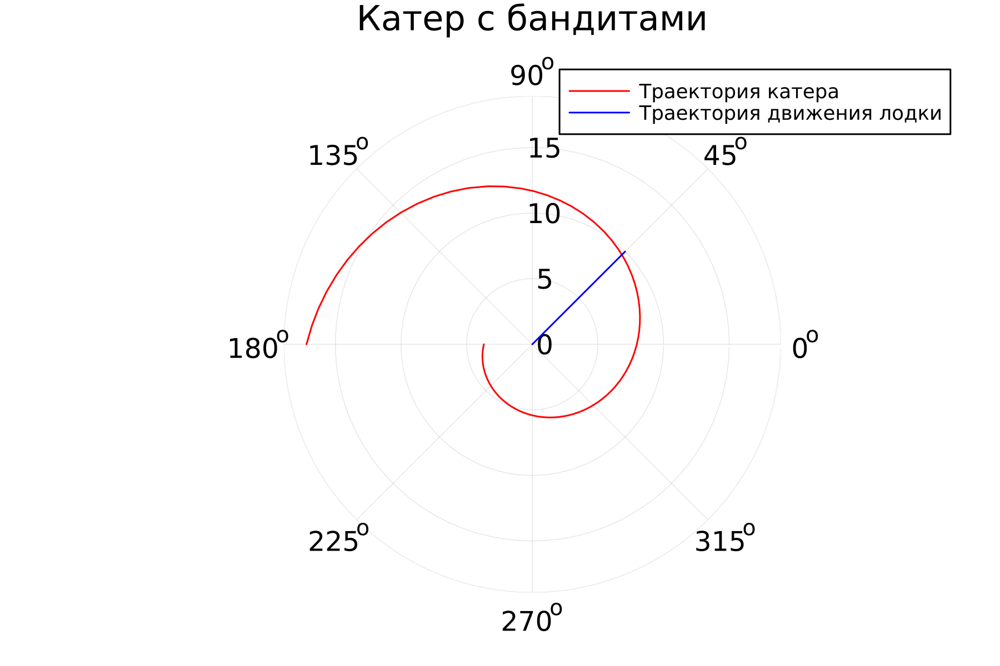

---
## Front matter
title: "Лабораторная работа №2"
subtitle: "Математическое моделирование"
author: "Николаев Дмитрий Иванович"

## Generic otions
lang: ru-RU
toc-title: "Содержание"

## Bibliography
bibliography: bib/cite.bib
csl: pandoc/csl/gost-r-7-0-5-2008-numeric.csl

## Pdf output format
toc: true # Table of contents
toc-depth: 2
lof: true # List of figures
lot: true # List of tables
fontsize: 12pt
linestretch: 1.5
papersize: a4
documentclass: scrreprt
## I18n polyglossia
polyglossia-lang:
  name: russian
  options:
	- spelling=modern
	- babelshorthands=true
polyglossia-otherlangs:
  name: english
## I18n babel
babel-lang: russian
babel-otherlangs: english
## Fonts
mainfont: PT Serif
romanfont: PT Serif
sansfont: PT Sans
monofont: PT Mono
mainfontoptions: Ligatures=TeX
romanfontoptions: Ligatures=TeX
sansfontoptions: Ligatures=TeX,Scale=MatchLowercase
monofontoptions: Scale=MatchLowercase,Scale=0.9
## Biblatex
biblatex: true
biblio-style: "gost-numeric"
biblatexoptions:
  - parentracker=true
  - backend=biber
  - hyperref=auto
  - language=auto
  - autolang=other*
  - citestyle=gost-numeric
## Pandoc-crossref LaTeX customization
figureTitle: "Рис."
tableTitle: "Таблица"
listingTitle: "Листинг"
lofTitle: "Список иллюстраций"
lotTitle: "Список таблиц"
lolTitle: "Листинги"
## Misc options
indent: true
header-includes:
  - \usepackage{indentfirst}
  - \usepackage{float} # keep figures where there are in the text
  - \floatplacement{figure}{H} # keep figures where there are in the text
---

# Цель работы

Научиться работать с Julia, его пакетами Plots для построения графиков и DifferentialEquations для решения дифференциальных уравнений. Решить задачу о погоне, построить графики траектории движения. Проверить возможность реализации этой задачи на языке OpenModelica.

# Задание

Вариант 29.

На море в тумане катер береговой охраны преследует лодку браконьеров.
Через определенный промежуток времени туман рассеивается, и лодка
обнаруживается на расстоянии 11,8 (k = 11.8) км от катера. Затем лодка снова скрывается в
тумане и уходит прямолинейно в неизвестном направлении. Известно, что скорость
катера в 4,2 раза больше скорости браконьерской лодки.

1. Запишите уравнение, описывающее движение катера, с начальными условиями для двух случаев (в зависимости от расположения катера
относительно лодки в начальный момент времени).
2. Постройте траекторию движения катера и лодки для двух случаев.
3. Найдите точку пересечения траектории катера и лодки.

# Теоретическое введение

Julia — высокоуровневый высокопроизводительный свободный язык программирования с динамической типизацией, созданный для математических вычислений. Эффективен также и для написания программ общего назначения. Синтаксис языка схож с синтаксисом других математических языков (например, MATLAB и Octave), однако имеет некоторые существенные отличия.
OpenModelica — свободное открытое программное обеспечение для моделирования, симуляции, оптимизации и анализа сложных динамических систем. Основано на языке Modelica.

# Выполнение лабораторной работы  

## Постановка задачи

1. Пусть место нахождения лодки браконьеров в момент обнаружения: $t_0=0,x_{л0}=0$. Пусть место нахождения катера береговой охраны относительно лодки браконьеров в момент обнаружения лодки: $x_{к0}=0$.
2. Введем полярные координаты. Будем считать, что полюс - это точка обнаружения лодки браконьеров $x_{л0}$ ($0=x_{л0}=0$) , а полярная ось r проходит через точку нахождения катера береговой охраны.
3. Траектория катера должна быть такой, чтобы и катер, и лодка все время были на одном расстоянии от полюса, только в этом случае траектория катера пересечется с траекторией лодки. Поэтому для начала катер береговой охраны должен двигаться некоторое время прямолинейно, пока не окажется на том же расстоянии от полюса, что и лодка браконьеров. После этого катер береговой охраны должен двигаться вокруг полюса удаляясь от него с той же скоростью, что и лодка браконьеров.
4. Чтобы найти расстояние X (расстояние, после которого катер начнет двигаться вокруг полюса), необходимо составить простое уравнение. Пусть через время t катер и лодка окажутся на одном расстоянии x от полюса. За это время лодка пройдет x, а катер — k-x (или k+x в зависимости от начального положения катера относительно полюса). Время, за которое они пройдут это расстояние, вычисляется как $\frac{x}{v}$ или $\frac{k-x}{4.2v}$ (во втором случае $\frac{k+x}{4.2v}$). Так как время одно и то же, то эти величины одинаковы. Тогда неизвестное расстояние x можно найти из следующего уравнения:$\frac{x}{v}=\frac{k-x}{4.2v}$ в первом случае (рис. [-@fig:001]) и $\frac{x}{v}=\frac{k+x}{4.2v}$ во втором (рис. [-@fig:002]). Отсюда мы найдем два значения $x_1=\frac{k}{5.2}$ и $x_2=\frac{k}{3.2}$ (k = 11.8), задачу будем решать для двух случаев.
5. После того, как катер береговой охраны окажется на одном расстоянии от полюса, что и лодка, он должен сменить прямолинейную траекторию и начать двигаться вокруг полюса, удаляясь от него со скоростью лодки v. Для этого скорость катера раскладываем на две составляющие: $v_r$ — радиальная скорость и $v_{\tau}$ — тангенциальная скорость. Радиальная скорость - это скорость, с которой катер удаляется от полюса, $v_r=\frac{dr}{dt}$. Нам нужно, чтобы эта скорость была равна скорости лодки, поэтому полагаем $\frac{dr}{dt}=v$. Тангенциальная скорость – это линейная скорость вращения катера относительно полюса. Она равна произведению угловой скорости $\frac{\partial \theta}{\partial t}$ на радиус r, $v_τ=r\frac{\partial \theta}{\partial t}$, $v_τ=\sqrt {17.64v^2-v^2}=\sqrt {16.64}v$ (учитывая, что радиальная скорость равна v). Тогда получаем $r\frac{\partial \theta}{\partial t}=\sqrt {16.64}v$.
6. Решение исходной задачи сводится к решению системы из двух дифференциальных уравнений. Далее, исключая из полученной системы производную по t, переходим к одному уравнению: $$\frac{\partial r}{\partial \theta}=\frac{r}{\sqrt {16.64}}.$$ При этом, начальные условия остаются прежними. Решив это уравнение, мы получаем траекторию движения катера в полярных координатах.

## Реализация на Julia

Код на Julia:

```julia
using Plots
using DifferentialEquations

const theta01 = 0
const theta02 = -pi
const r01 = 11.8/5.2
const r02 = 11.8/3.2
const T1 = (theta01, 2pi)
const T2 = (theta02, pi)
const phi = pi/4

function F(u, p, t)
    return u/\sqrt(16.64)
end

prob1 = ODEProblem(F, r01, T1)
prob2 = ODEProblem(F, r02, T2)

sol1 = solve(
  prob1,
  abstol=1e-16,
  reltol=1e-16)
sol2 = solve(
    prob2,
    abstol=1e-16,
    reltol=1e-16)

plt1 = plot(
    proj = :polar,
    aspect_ratio=:equal,
    dpi=300,
    legend=true)

plot!(
    plt1,
    sol1.t,
    sol1.u,
    xlabel="theta",
    ylabel="r(theta)",
    label="Траектория катера",
    color=:red,
    title="Катер с бандитами")
plot!(
    plt1, 
    fill(phi,11), 
    collect(0:10), 
    label="Траектория движения лодки", 
    color=:blue)         
    
plt2 = plot(
    proj = :polar,
    aspect_ratio=:equal,
    dpi=300,
    legend=true)
plot!(
    plt2,
    sol2.t,
    sol2.u,
    xlabel="theta",
    ylabel="r(theta)",
    label="Траектория катера",
    color=:red,
    title="Катер с бандитами")
plot!(
    plt2, 
    fill(phi,11), 
    collect(0:10), 
    label="Траектория движения лодки", 
    color=:blue)

savefig(plt1, "image/lab02_1.png")
savefig(plt2, "image/lab02_2.png")
```

## Полученные графики

{#fig:001 width=70%}

{#fig:002 width=70%}

# Выводы

В ходе выполнения лабораторной работы я освоил основы Julia и двух библиотек - Plots и DifferentialEquations, научился решать задачу о погоне и строить графики, записал уравнение, описывающее движение катера в погоне за лодкой, с начальными условиями для двух случаев (в зависимости от расположения катера относительно лодки в начальный момент времени), построил траекторию движения катера и лодки для двух случаев, нашёл точку пересечения траектории катера и лодки графически.
На OpenModelica данная задача решается с куда большими трудностями из-за наличия производных только по времени и сложности построения графика для системы дифференциальных уравнений.

# Список литературы{.unnumbered}

[@lab2]
