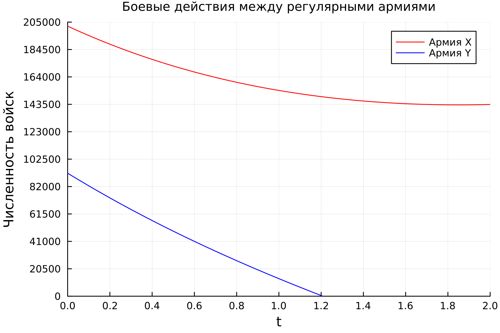
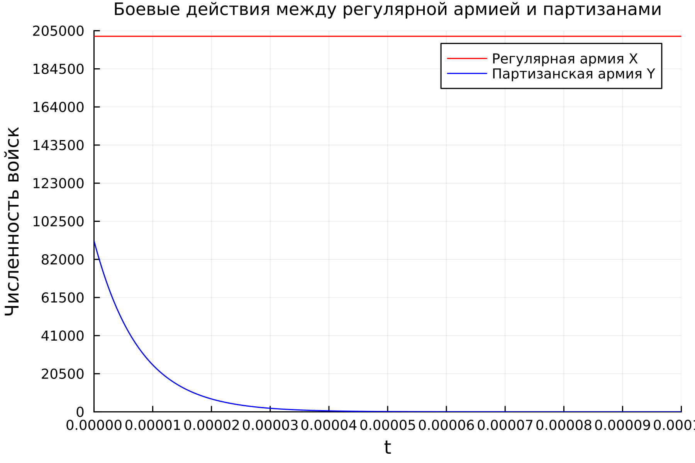
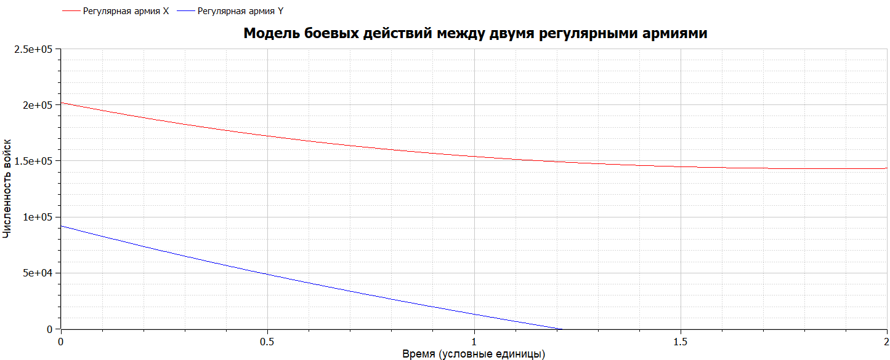
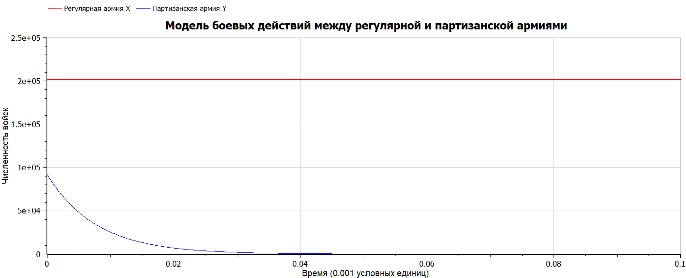

---
## Front matter
title: "Лабораторная работа №3"
subtitle: "Математическое моделирование"
author: "Николаев Дмитрий Иванович"

## Generic otions
lang: ru-RU
toc-title: "Содержание"

## Bibliography
bibliography: bib/cite.bib
csl: pandoc/csl/gost-r-7-0-5-2008-numeric.csl

## Pdf output format
toc: true # Table of contents
toc-depth: 2
lof: true # List of figures
lot: true # List of tables
fontsize: 12pt
linestretch: 1.5
papersize: a4
documentclass: scrreprt
## I18n polyglossia
polyglossia-lang:
  name: russian
  options:
	- spelling=modern
	- babelshorthands=true
polyglossia-otherlangs:
  name: english
## I18n babel
babel-lang: russian
babel-otherlangs: english
## Fonts
mainfont: PT Serif
romanfont: PT Serif
sansfont: PT Sans
monofont: PT Mono
mainfontoptions: Ligatures=TeX
romanfontoptions: Ligatures=TeX
sansfontoptions: Ligatures=TeX,Scale=MatchLowercase
monofontoptions: Scale=MatchLowercase,Scale=0.9
## Biblatex
biblatex: true
biblio-style: "gost-numeric"
biblatexoptions:
  - parentracker=true
  - backend=biber
  - hyperref=auto
  - language=auto
  - autolang=other*
  - citestyle=gost-numeric
## Pandoc-crossref LaTeX customization
figureTitle: "Рис."
tableTitle: "Таблица"
listingTitle: "Листинг"
lofTitle: "Список иллюстраций"
lotTitle: "Список таблиц"
lolTitle: "Листинги"
## Misc options
indent: true
header-includes:
  - \usepackage{indentfirst}
  - \usepackage{float} # keep figures where there are in the text
  - \floatplacement{figure}{H} # keep figures where there are in the text
---

# Цель работы

Рассмотреть простейшую модель боевых действий --- модель Ланчестера. Научиться строить графики для данной модели в двух случаях: сражение регулярных армий и партизанской с регулярной. Освоить возможности OpenModelica и Julia для решения данной задачи.

# Задание

Вариант 29

Между страной Х и страной У идет война. Численность состава войск исчисляется от начала войны, и являются временными функциями x(t) и y(t). В начальный момент времени страна Х имеет армию численностью 202000 человек, а в распоряжении страны У армия численностью в 92000 человек. Для упрощения модели считаем, что коэффициенты a, b, c, h
постоянны. Также считаем P(t) и Q(t) непрерывные функции (см. [@lab3]).
Постройте графики изменения численности войск армии Х и армии У для следующих случаев:

1. Модель боевых действий между регулярными войсками
$$
\frac{dx}{dt} = -0.13x(t) - 0.51y(t) + 0.5\sin (t + 13)
$$
$$
\frac{dy}{dt} = -0.41x(t) - 0.15y(t) + 0.5\cos (t + 2)
$$
2. Модель ведение боевых действий с участием регулярных войск и партизанских отрядов:
$$
\frac{dx}{dt} = -0.08x(t) - 0.76y(t) + \sin (2t) + 1
$$
$$
\frac{dy}{dt} = -0.64x(t)y(t) - 0.07y(t) + \cos (3t) + 1
$$

# Теоретическое введение

Модель Ланчестера. В противоборстве могут принимать участие как регулярные войска, так и партизанские отряды. В общем случае главной характеристикой соперников являются численности сторон. Если в какой-то момент времени одна из численностей обращается в нуль, то данная сторона считается проигравшей (при условии, что численность другой стороны в данный момент положительна). Уравнения Ланчестера — это дифференциальные уравнения, описывающие зависимость между силами сражающихся сторон A и D как функцию от времени, причем функция зависит только от A и D ([@lan]).

# Выполнение лабораторной работы

## Постановка задачи

Рассмотри два случая ведения боевых действий:

1. Боевые действия между регулярными войсками

2. Боевые действия с участием регулярных войск и партизанских отрядов

В первом случае численность регулярных войск определяется тремя факторами:

- Скорость уменьшения численности войск из-за причин, не связанных с боевыми действиями (болезни, травмы, дезертирство);

- Скорость потерь, обусловленных боевыми действиями противоборствующих сторон (что связанно с качеством стратегии, уровнем вооружения, профессионализмом солдат и т.п.);

- Скорость поступления подкрепления (задаётся некоторой функцией от времени).

В этом случае модель боевых действий между регулярными войсками описывается следующим образом $$ dx/dt = -a(t)x(t)-b(t)y(t)+P(t), $$ $$dy/dt = -c(t)x(t)-h(t)y(t)+Q(t). $$

Потери, не связанные с боевыми действиями, описывают члены -a(t)x(t) и -h(t)y(t) , члены -b(t)y(t) и -c(t)x(t) отражают потери на поле боя. Коэффициенты b(t) и c(t) указывают на эффективность боевых действий со стороны Y и X соответственно, a(t), h(t) - величины, характеризующие степень влияния различных факторов на потери. Функции P(t), Q(t) учитывают возможность подхода подкрепления к войскам Х и У в течение одного дня.

Во втором случае в борьбу добавляются партизанские отряды. Нерегулярные войска в отличии от постоянной армии менее уязвимы, так как действуют скрытно, в этом случае сопернику приходится действовать неизбирательно, по площадям, занимаемым партизанами. Поэтому считается, что тем потерь партизан, проводящих свои операции в разных местах на некоторой известной территории, пропорционален не только численности армейских соединений, но и численности самих партизан. В результате модель принимает вид (в этой системе все величины имею тот же смысл): $$ dx/dt = -a(t)x(t)-b(t)y(t)+P(t), $$ $$dy/dt = -c(t)x(t)y(t)-h(t)y(t)+Q(t). $$

Далее необходимо реализовать решение задачи и построить графики для обоих случаев на языке Julia и OpenModelica.

## Реализация на Julia

- Боевые действия между регулярными армиями (Рис. [-@fig:001]).
- Боевые действия с участием регулярных войск и партизанских отрядов (Рис. [-@fig:002]).

Код на Julia:

```julia
using Plots
using DifferentialEquations

function lorenz1!(du,u,p,t)
    du[1] = -0.13*u[1] - 0.51*u[2] + sin(t + 13)/2
    du[2] = -0.41*u[1] - 0.15*u[2] + cos(t + 2)/2
end

function lorenz2!(du,u,p,t)
    du[1] = -0.08u[1] - 0.76u[2] + sin(2t) + 1
    du[2] = -0.64u[1]*u[2] - 0.07u[2] + cos(3t) + 1
end

const u0 = [202000, 92000]
const T1 = (0.0, 2.0)
const T2 = (0.0, 0.0001)

prob1 = ODEProblem(lorenz1!, u0, T1)
prob2 = ODEProblem(lorenz2!, u0, T2)

sol1 = solve(
    prob1,
    abstol=1e-8,
    reltol=1e-8)

sol2 = solve(
    prob2,
    abstol=1e-8,
    reltol=1e-8)

plt1 = plot(
    dpi=300,
    legend=true)
plot!(
    plt1,
    sol1,
    idxs=(0,1),
    label="Армия X",
    xlabel="Время",
    ylabel="Численность войск",
    ylims = (0, 205000),
    yscale =:identity,
    yticks = 0:20500:205000, 
    xticks = 0:0.2:2,
    formatter=:plain,
    legend_position=:topright,
    titlefontsize=:10,
    color=:red,
    title="Боевые действия между регулярными армиями")
plot!(
    plt1,
    sol1,
    idxs=(0,2),
    label="Армия Y",
    color=:blue)
           
plt2 = plot(
    dpi=300,
    legend=true)
plot!(
    plt2,
    sol2,
    idxs=(0,1),
    label="Регулярная армия X",
    xlabel="Время",
    ylabel="Численность войск",
    ylims = (0, 205000),
    yscale =:identity,
    yticks = 0:20500:205000, 
    xticks = 0:0.00001:0.0001,
    formatter=:plain,
    legend_position=:topright,
    titlefontsize=:10,
    color=:red,
    title="Боевые действия между регулярной армией и партизанами")
plot!(
    plt2,
    sol2,
    idxs=(0,2),
    label="Партизанская армия Y",
    color=:blue)

savefig(plt1, "image/lab03_1.png")
savefig(plt2, "image/lab03_2.png")
```

## Реализация на OpenModelica

- Боевые действия между регулярными армиями (Рис. [-@fig:003]).
- Боевые действия с участием регулярных войск и партизанских отрядов (Рис. [-@fig:004]).

Код на OpenModelica:

Первая модель боевый действия между регулярными армиями:

```OpenModelica
model model1
Real x;
Real y;
initial equation
  x = 202000;
  y = 92000;
equation
  der(x) = -0.13*x - 0.51*y + sin(time + 13)/2;
  der(y) = -0.41*x - 0.15*y + cos(time + 2)/2;
end model1;
```

Вторая модель боевых действий между регулярными и партизанскими армиями:

```OpenModelica
model model2
Real x;
Real y;
initial equation
  x = 202000;
  y = 92000;
equation
  der(x) = -0.08*x - 0.76*y + sin(2*time) + 1;
  der(y) = -0.64*x*y - 0.07*y + cos(3*time) + 1;
end model2;
```

## Полученные графики

{#fig:001 width=90%}

{#fig:002 width=90%}

{#fig:003 width=90%}

{#fig:004 width=90%}

# Выводы

В ходе выполнения лабораторной работы я освоил возможности Julia и OpenModelica для простейшей модели боевых действий --- модели Ланчестера, построил графики для данной модели.

# Список литературы{.unnumbered}

::: {#refs}
:::
