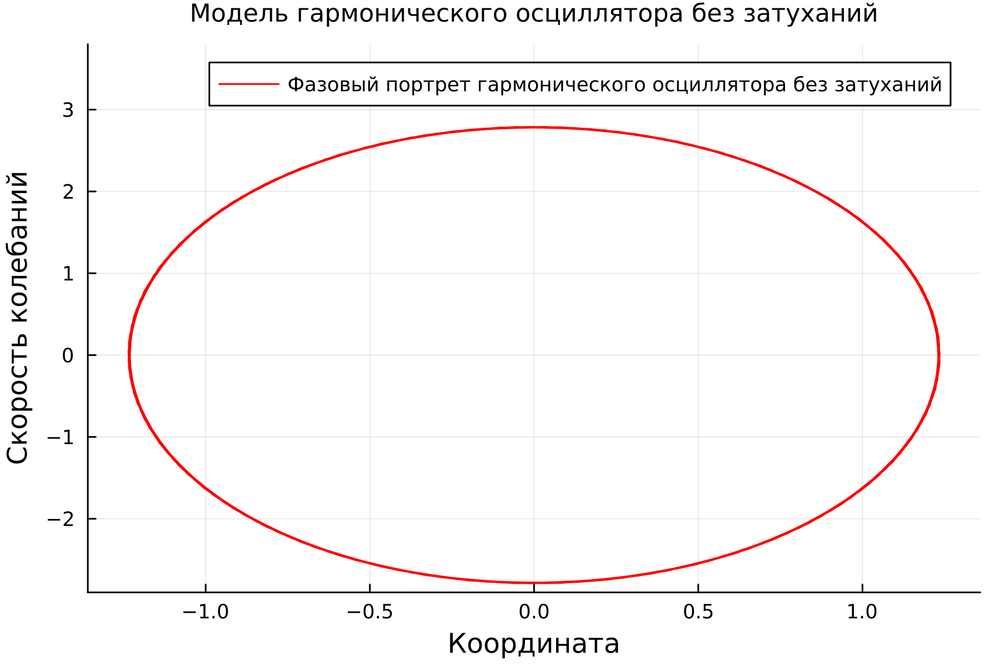
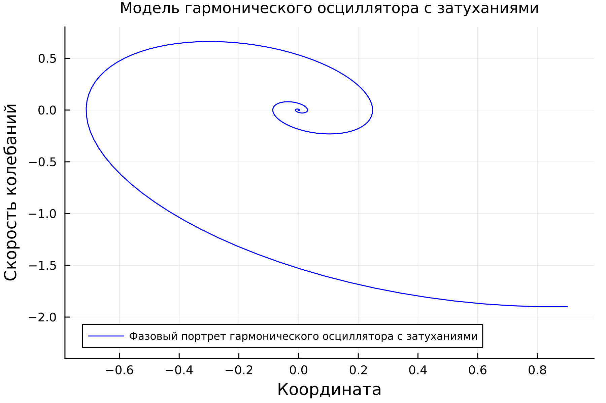
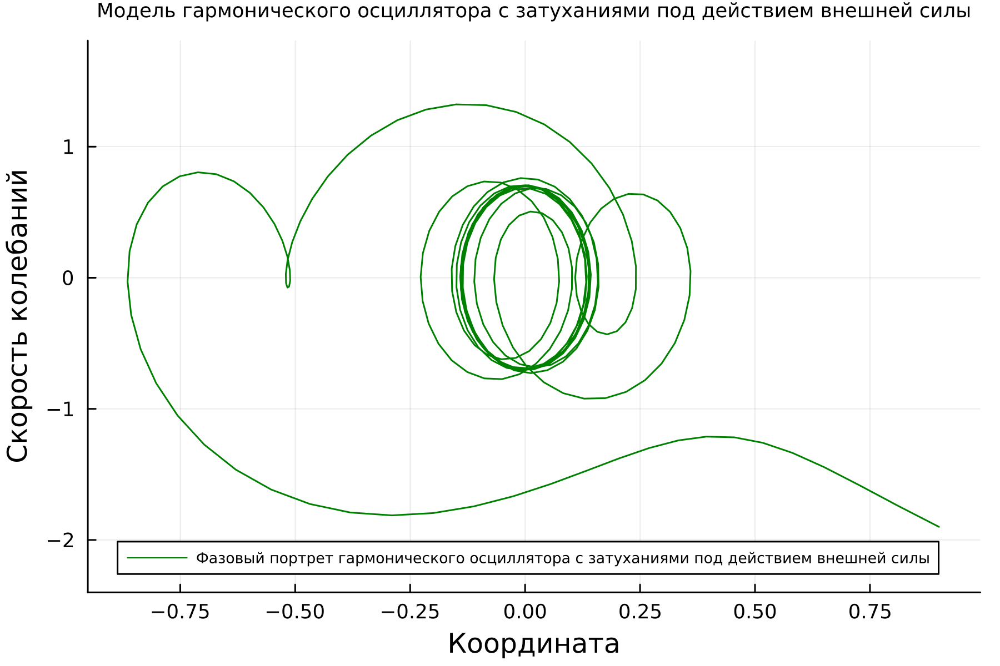

---
## Front matter
lang: ru-RU
title: Лабораторная работа №4
subtitle: Математическое моделирование
author:
  - Николаев Д. И.
institute:
  - Российский университет дружбы народов, Москва, Россия
date: 4 марта 2023

## i18n babel
babel-lang: russian
babel-otherlangs: english

## Formatting pdf
toc: false
toc-title: Содержание
slide_level: 2
aspectratio: 169
section-titles: true
theme: metropolis
header-includes:
 - \metroset{progressbar=frametitle,sectionpage=progressbar,numbering=fraction}
 - '\makeatletter'
 - '\beamer@ignorenonframefalse'
 - '\makeatother'
---

# Прагматика выполнения

- Познакомиться с моделями гармонических колебаний с затуханием и без затухания, а также под действием внешних сил и без их действия;
- Научиться строить фазовые портреты с помощью Julia и OpenModelica;
- Примение полученных знаний на практике в дальнейшем.

# Цели

- Дальнейшее развитие навыков работы с Julia и OpenModelica;
- Построить фазовый портрет гармонического осциллятора в различных случаях;
- Решить уравнения гармонического осциллятора;
- Получить новые знания в ходе выполнения лабораторной работы.

# Задачи

Постройте фазовый портрет гармонического осциллятора и решение уравнения гармонического осциллятора для следующих случаев:

1. Колебания гармонического осциллятора без затуханий и без действий внешней силы
$$
\ddot{x} + 5.1x = 0
$$
2. Колебания гармонического осциллятора c затуханием и без действий внешней силы
$$
\ddot{x} + 0.9\dot{x} + 2x = 0
$$
3. Колебания гармонического осциллятора c затуханием и под действием внешней силы
$$
\ddot{x} + 0.9\dot{x} + 1.9x = 3.3\cos(5t)
$$

На интервале $t\in [0,38]$ (шаг 0.05) с начальными условиями $x_0=0.9$, $y_0=-1.9.$

# Полученные графики

## Колебания без затухания и без внешней силы

{#fig:001 width=80%}

## Колебания с затуханиями и без внешней силы

{#fig:002 width=80%}

## Колебания с затуханиями и под действием внешней силы

{#fig:003 width=80%}

# Результаты

По результатам работы, я научился решать дифференциальные уравнения гармонического осциллятора и строить фазовые портреты гармонических колебаний в языках Julia и OpenModelica.
