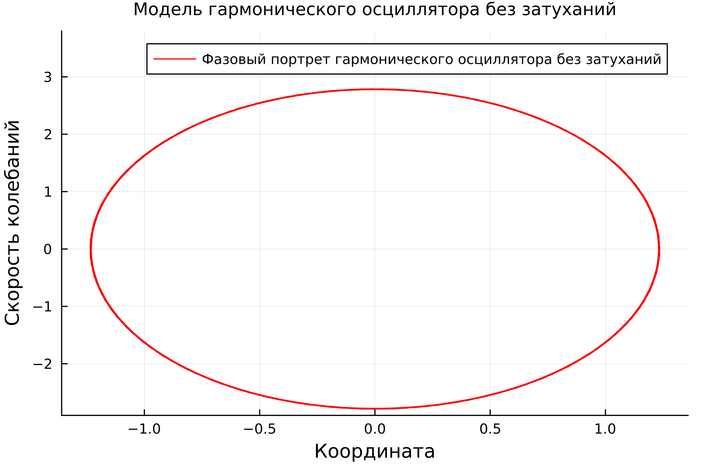
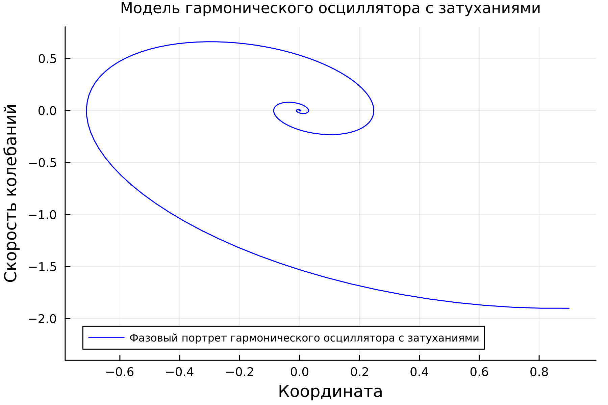
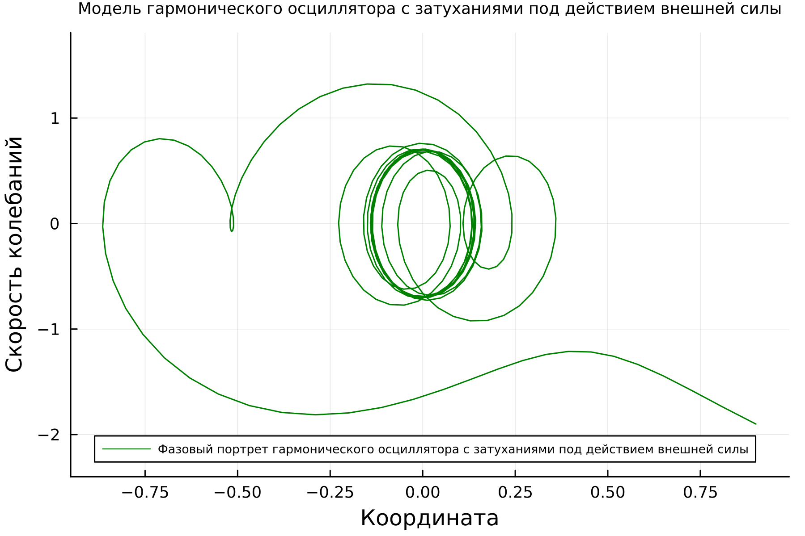
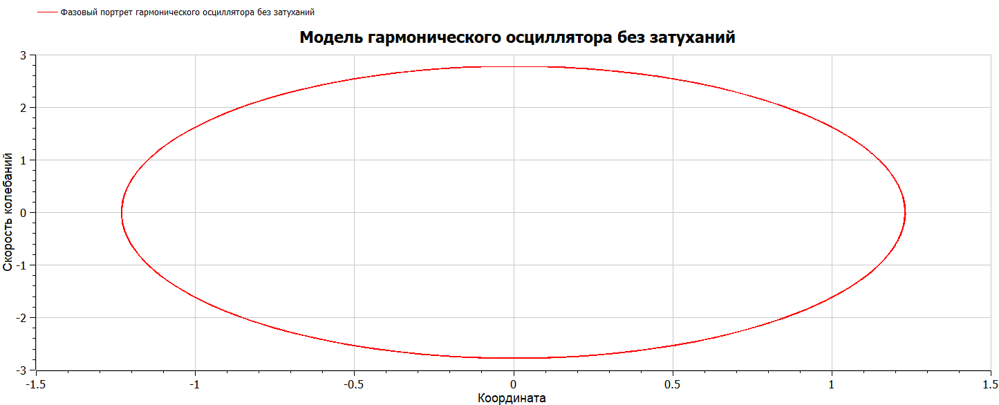
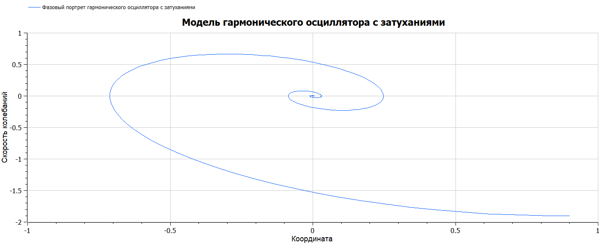
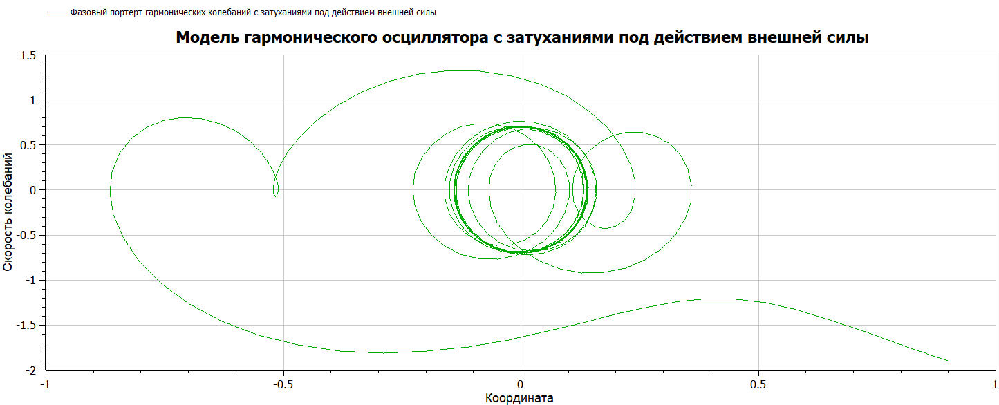

---
## Front matter
title: "Лабораторная работа №4"
subtitle: "Математическое моделирование"
author: "Николаев Дмитрий Иванович"

## Generic otions
lang: ru-RU
toc-title: "Содержание"

## Bibliography
bibliography: bib/cite.bib
csl: pandoc/csl/gost-r-7-0-5-2008-numeric.csl

## Pdf output format
toc: true # Table of contents
toc-depth: 2
lof: true # List of figures
lot: true # List of tables
fontsize: 12pt
linestretch: 1.5
papersize: a4
documentclass: scrreprt
## I18n polyglossia
polyglossia-lang:
  name: russian
  options:
	- spelling=modern
	- babelshorthands=true
polyglossia-otherlangs:
  name: english
## I18n babel
babel-lang: russian
babel-otherlangs: english
## Fonts
mainfont: PT Serif
romanfont: PT Serif
sansfont: PT Sans
monofont: PT Mono
mainfontoptions: Ligatures=TeX
romanfontoptions: Ligatures=TeX
sansfontoptions: Ligatures=TeX,Scale=MatchLowercase
monofontoptions: Scale=MatchLowercase,Scale=0.9
## Biblatex
biblatex: true
biblio-style: "gost-numeric"
biblatexoptions:
  - parentracker=true
  - backend=biber
  - hyperref=auto
  - language=auto
  - autolang=other*
  - citestyle=gost-numeric
## Pandoc-crossref LaTeX customization
figureTitle: "Рис."
tableTitle: "Таблица"
listingTitle: "Листинг"
lofTitle: "Список иллюстраций"
lotTitle: "Список таблиц"
lolTitle: "Листинги"
## Misc options
indent: true
header-includes:
  - \usepackage{indentfirst}
  - \usepackage{float} # keep figures where there are in the text
  - \floatplacement{figure}{H} # keep figures where there are in the text
---

# Цель работы

Построить фазовый портрет гармонического осциллятора и решить уравнения гармонического осциллятора в случаях без затухания, с затуханиями и с действием внешней силы.

# Задание

Вариант 29

Постройте фазовый портрет гармонического осциллятора и решение уравнения гармонического осциллятора для следующих случаев:

1. Колебания гармонического осциллятора без затуханий и без действий внешней силы:
$$
\ddot{x} + 5.1x = 0
$$
2. Колебания гармонического осциллятора c затуханием и без действий внешней силы:
$$
\ddot{x} + 0.9\dot{x} + 2x = 0
$$
3. Колебания гармонического осциллятора c затуханием и под действием внешней силы:
$$
\ddot{x} + 0.9\dot{x} + 1.9x = 3.3\cos(5t)
$$
На интервале t = [0; 38] (шаг 0.05) с начальными условиями $x_0 = 0.9$ и $y_0 = -1.9$.

# Теоретическое введение

Гармонические колебания — колебания, при которых физическая величина изменяется с течением времени по гармоническому (синусоидальному, косинусоидальному) закону.

Осциллятор — система, совершающая колебания, то есть показатели которой периодически повторяются во времени.

Гармонические колебания выделяются из всех остальных видов колебаний по следующим причинам:

- Во многих случаях малые колебания, как свободные, так и вынужденные, которые происходят в реальных системах, можно считать имеющими форму гармонических колебаний или очень близкую к ней.
- Как установил в 1822 году Фурье, широкий класс периодических функций может быть разложен на сумму тригонометрических компонентов — в ряд Фурье. Другими словами, любое периодическое колебание может быть представлено как сумма гармонических колебаний с соответствующими амплитудами, частотами и начальными фазами. Среди слагаемых этой суммы существует гармоническое колебание с наименьшей частотой, которая называется основной частотой, а само это колебание — первой гармоникой или основным тоном, частоты же всех остальных слагаемых, гармонических колебаний, кратны основной частоте, и эти колебания называются высшими гармониками или обертонами — первым, вторым и т.д.
- Для широкого класса систем откликом на гармоническое воздействие является гармоническое колебание (свойство линейности), при этом связь воздействия и отклика является устойчивой характеристикой системы. С учётом предыдущего свойства это позволяет исследовать прохождение колебаний произвольной формы через системы. ([@oscillator])

Для перехода от дифференциального уравнения второго порядка: $$ \ddot{x} + 2\gamma \dot{x} + \omega^2_0 x = F(t) $$ к системе из двух уравнений первого порядка, нужно сделать следующую замену: $$ y=\dot{x}. $$ Тогда полученная система уравнений примет следующий вид:
$$
\begin{cases}
\dot{x} = y, \\
\dot{y}= -2\gamma y -\omega^2_0 x + F(t).
\end{cases}
$$
С начальными условиями:
$$
\begin{cases}
x(t_0) = x_0, \\
\dot{x}(t_0)= y_0.
\end{cases}
$$

# Выполнение лабораторной работы

## Постановка задачи

Уравнение свободных колебаний гармонического осциллятора имеет следующий вид: $$ \ddot{x}+2\gamma\dot{x}+\omega^2_0 x = 0 $$ Это уравнение есть линейное однородное дифференциальное уравнение второго порядка и оно является примером линейной динамической системы.

При отсутствии потерь в системе вместо этого уравнения получаем уравнение консервативного осциллятора энергия колебания которого сохраняется во времени: $$ \ddot{x}+\omega^2_0 x = 0 $$ Для однозначной разрешимости уравнения второго порядка необходимо задать два начальных условия вида:
$$
\begin{cases}
x(t_0)=x_0, \\
\dot{x}(t_0)=y_0.
\end{cases}
$$
Уравнение второго порядка можно представить в виде системы двух уравнений первого порядка:
$$
\begin{cases}
\dot{x}=y, \\
\dot{y}=-\omega^2_0 x.
\end{cases}
$$
Начальные условия для системы примут вид:
$$
\begin{cases}
x(t_0)=x_0, \\
y(t_0)=y_0.
\end{cases}
$$
Независимые переменные $x$, $y$ определяют пространство, в котором «движется» решение. Это фазовое пространство системы, поскольку оно двумерно будем называть его фазовой плоскостью.

Значение фазовых координат $x$, $y$ в любой момент времени полностью определяет состояние системы. Решению уравнения движения как функции времени отвечает гладкая кривая в фазовой плоскости. Она называется фазовой траекторией. Если множество различных решений (соответствующих различным начальным условиям) изобразить на одной фазовой плоскости, возникает общая картина поведения системы. Такую картину, образованную набором фазовых траекторий, называют фазовым портретом ([@lab4]).

## Реализация на Julia

- Фазовый портрет гармонического осциллятора без затуханий (Рис. [@fig:001]).
- Фазовый портрет гармонического осциллятора с затуханиями (Рис. [@fig:002]).
- Фазовый портрет гармонического осциллятора с затуханиями под действием внешней силы (Рис. [@fig:003]).

Код на Julia:

```julia
using Plots
using DifferentialEquations

const g1 = 0;    # Параметр, характеризующий потери в системе
const g2 = 0.9;
const g3 = g2;
const w1 = 5.1;   #Собственная частота колебаний
const w2 = 2.0;
const w3 = 1.9;  

# u[1] - x, u[2] - y, где x - координата колебаний, y - скорость колебаний, du[1]=dx/dt, du[2]=dy/dt
function lorenz1!(du,u,p,t)  # Модель колебаний без затуханий
    du[1] = u[2]
    du[2] = -w1*u[1] - g1*du[1]
end

function lorenz2!(du,u,p,t)  # Модель колебаний с затуханиями
    du[1] = u[2]
    du[2] = -w2*u[1] - g2*du[1]
end

function lorenz3!(du,u,p,t)  # Модель колебаний с затуханиями под действием внешней силы
    du[1] = u[2]
    du[2] = -w3*u[1] - g3*du[1] + 3.3*cos(5*t)
end

const u0 = [0.9, -1.9]
const T = [0.0, 38.0]

prob1 = ODEProblem(lorenz1!, u0, T)
prob2 = ODEProblem(lorenz2!, u0, T)
prob3 = ODEProblem(lorenz3!, u0, T)

sol1 = solve(
    prob1,
    saveat = 0.05)

sol2 = solve(
    prob2,
    saveat = 0.05)

sol3 = solve(
    prob3,
    saveat = 0.05)
y1_max = maximum(sol1.u[2])
y2_max = maximum(sol2.u[2])
y3_max = maximum(sol3.u[2])

plt1 = plot(
    dpi=300,
    legend=true)
plot!(
    plt1,
    sol1,
    idxs=(1,2),
    label="Фазовый портрет гармонического осциллятора без затуханий",
    xlabel="Координата",
    ylabel="Скорость колебаний",
    ylims = (u0[2]-1, y1_max + 3),
    legend_position=:topright,
    titlefontsize=:10,
    color=:red,
    title="Модель гармонического осциллятора без затуханий")
           
plt2 = plot(
    dpi=300,
    legend=true)
plot!(
    plt2,
    sol2,
    idxs=(1,2),
    label="Фазовый портрет гармонического осциллятора с затуханиями",
    xlabel="Координата",
    ylabel="Скорость колебаний",
    ylims = (u0[2] - 0.5, y2_max),
    legend_position=:bottomleft,
    legend_font_pointsize=:7,
    titlefontsize=:10,
    color=:blue,
    title="Модель гармонического осциллятора с затуханиями")

plt3 = plot(
    dpi=300,
    legend=true)
plot!(
    plt3,
    sol3,
    idxs=(1,2),
    label="Фазовый портрет гармонического осциллятора с затуханиями под действием внешней силы",
    xlabel="Координата",
    ylabel="Скорость колебаний",
    ylims = (u0[2] - 0.5, y3_max + 1),
    legend_position=:bottomleft,
    legend_font_pointsize=:6,
    titlefontsize=:8,
    color=:green,
    title="Модель гармонического осциллятора с затуханиями под действием внешней силы")

savefig(plt1, "image/lab04_1.png")
savefig(plt2, "image/lab04_2.png")
savefig(plt3, "image/lab04_3.png")

```

## Реализация на OpenModelica

- Фазовый портрет гармонического осциллятора без затуханий (Рис. [@fig:004]).
- Фазовый портрет гармонического осциллятора с затуханиями (Рис. [@fig:005]).
- Фазовый портрет гармонического осциллятора с затуханиями под действием внешней силы (Рис. [@fig:006]).

Код на OpenModelica:

Первая модель гармонических колебаний без затуханий:

```OpenModelica
model oscillator1
Real x;
Real y;
initial equation
  x = 0.9;
  y = -1.9;
equation
  der(x) = y;
  der(y) = -5.1*x;
end oscillator1;
```

Вторая модель гармонических колебаний с затуханиями:

```OpenModelica
model oscillator2
Real x;
Real y;
initial equation
  x = 0.9;
  y = -1.9;
equation
  der(x) = y;
  der(y) = -2*x - 0.9*der(x);
end oscillator2;
```

Третья модель гармонических колебаний с затуханиями под действием внешней силы:

```OpenModelica
model oscillator3
Real x;
Real y;
initial equation
  x = 0.9;
  y = -1.9;
equation
  der(x) = y;
  der(y) = -1.9*x - 0.9*der(x) + 3.3*cos(5*time);
end oscillator3;
```

## Полученные графики

{#fig:001 width=90%}

{#fig:002 width=90%}

{#fig:003 width=90%}

{#fig:004 width=90%}

{#fig:005 width=90%}

{#fig:006 width=90%}

# Выводы

В ходе выполнения лабораторной работы я научился строить фазовый портрет гармонического осциллятора и решать уравнения гармонического осциллятора.

# Список литературы{.unnumbered}

::: {#refs}
:::
