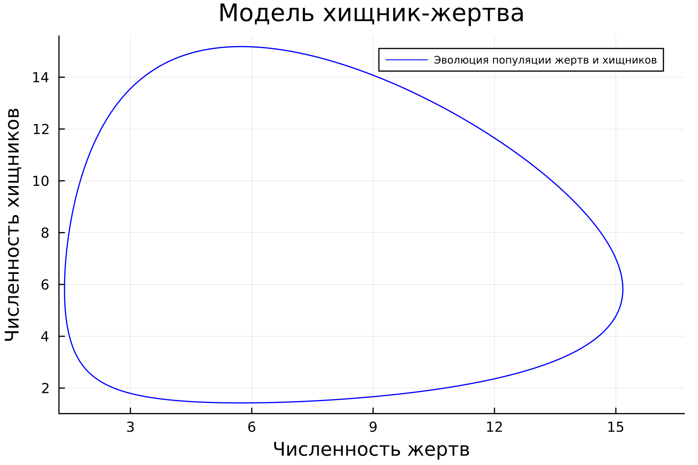
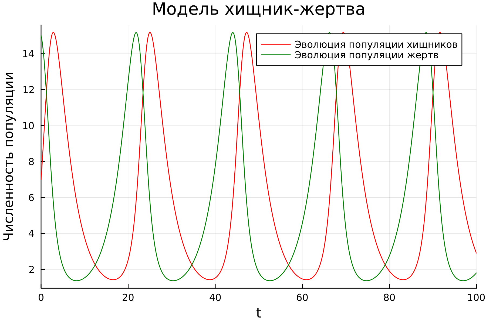

---
## Front matter
lang: ru-RU
title: Лабораторная работа №5
subtitle: Математическое моделирование
author:
  - Николаев Д. И.
institute:
  - Российский университет дружбы народов, Москва, Россия
date: 11 марта 2023

## i18n babel
babel-lang: russian
babel-otherlangs: english

## Formatting pdf
toc: false
toc-title: Содержание
slide_level: 2
aspectratio: 169
section-titles: true
theme: metropolis
header-includes:
 - \metroset{progressbar=frametitle,sectionpage=progressbar,numbering=fraction}
 - '\makeatletter'
 - '\beamer@ignorenonframefalse'
 - '\makeatother'
---

# Прагматика выполнения

- Ознакомление с моделью Лотки-Вольтерры;
- Овладение навыками построения фазового портрета системы с помощью OpenModelica и Julia;
- Примение полученных знаний на практике в дальнейшем.

# Цели

- Научиться работать с Julia и OpenModelica;
- Построить график зависимости численности хищников от численности жертв при заданных начальных условиях;
- Построить графики изменения численности хищников и численности жертв в зависимости от времени при заданных начальных условиях;
- Найти стационарное состояние системы.

# Модель Лотки-Вольтерры

Модель Лотки-Вольтерры — модель взаимодействия двух видов типа «хищник — жертва», названная в честь её авторов, которые предложили модельные уравнения независимо друг от друга. Такие уравнения можно использовать для моделирования систем «хищник — жертва», «паразит — хозяин», конкуренции и других видов взаимодействия между двумя видами.

# Задачи

1. Освоить возможности языка OpenModelica и Julia для решения систем дифференциальных уравнений.
2. Решить систему дифференциальных уравнений изменения численности популяций хищников и жертв в модели Лотки-Вольтерры:
$$
\begin{cases}
\frac{dx}{dt} = -0.31x(t) + 0.054x(t)y(t), \\
\frac{dy}{dt} = 0.32x(t) - 0.055x(t)y(t).
\end{cases}
$$
3. Построить график зависимости численности хищников от численности жертв и графики изменения численности хищников и численности жертв в зависимости от времени при следующих начальных условиях: $x_0 = 7$ и $y_0 = 15$.
4. Найти стационарное состояние системы.

# Полученные графики

## Численность хищников в зависимости от численности жертв

{#fig:001 width=90%}

## Численности хищников и жертв в зависимости от времени

{#fig:002 width=90%}

# Стационарное состояние

Стационарное состояние системы находится из значений коэффициентов системы дифференциальных уравнений следующим образом:
$$
\begin{cases}
x_0 = \frac{c}{d}, \\
y_0 = \frac{a}{b}.
\end{cases}
$$
Что в нашем случае даст следующие значения:
$$
\begin{cases}
x_0 = \frac{0.32}{0.055} \approx 5.8182, \\
y_0 = \frac{0.31}{0.054} \approx 5.7407.
\end{cases}
$$

# Результаты

По результатам работы, я научился составлять системы дифференциальных уравнений изменения численности популяций хищников и жертв в модели Лотки-Вольтерры, построил график зависимости численности хищников от численности жертв и графики изменения численности хищников и численности жертв в зависимости от времени в языках Julia и OpenModelica.
