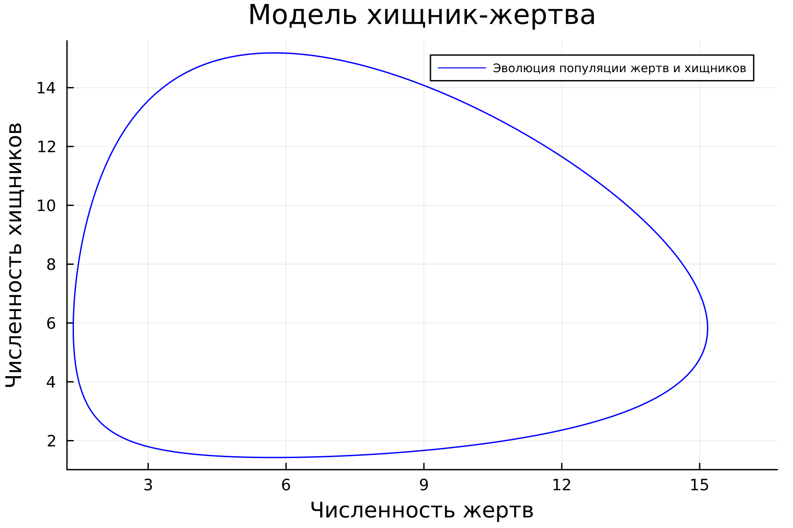
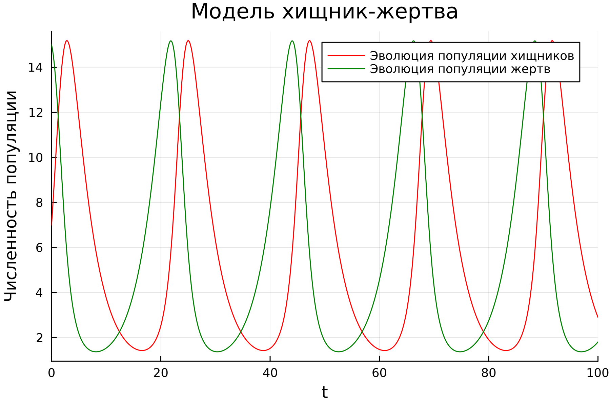
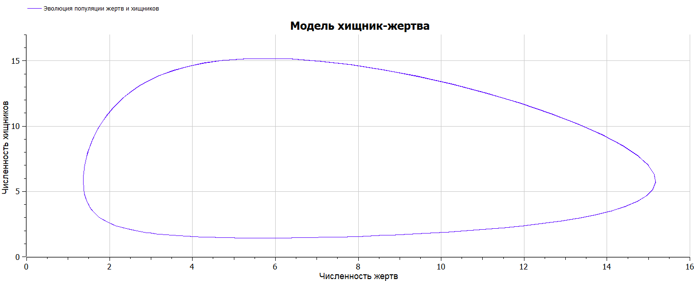
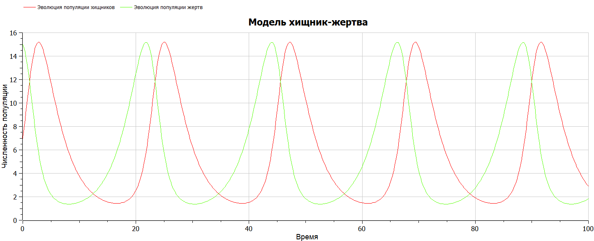

---
## Front matter
title: "Лабораторная работа №5"
subtitle: "Математическое моделирование"
author: "Николаев Дмитрий Иванович"

## Generic otions
lang: ru-RU
toc-title: "Содержание"

## Bibliography
bibliography: bib/cite.bib
csl: pandoc/csl/gost-r-7-0-5-2008-numeric.csl

## Pdf output format
toc: true # Table of contents
toc-depth: 2
lof: true # List of figures
lot: true # List of tables
fontsize: 12pt
linestretch: 1.5
papersize: a4
documentclass: scrreprt
## I18n polyglossia
polyglossia-lang:
  name: russian
  options:
	- spelling=modern
	- babelshorthands=true
polyglossia-otherlangs:
  name: english
## I18n babel
babel-lang: russian
babel-otherlangs: english
## Fonts
mainfont: PT Serif
romanfont: PT Serif
sansfont: PT Sans
monofont: PT Mono
mainfontoptions: Ligatures=TeX
romanfontoptions: Ligatures=TeX
sansfontoptions: Ligatures=TeX,Scale=MatchLowercase
monofontoptions: Scale=MatchLowercase,Scale=0.9
## Biblatex
biblatex: true
biblio-style: "gost-numeric"
biblatexoptions:
  - parentracker=true
  - backend=biber
  - hyperref=auto
  - language=auto
  - autolang=other*
  - citestyle=gost-numeric
## Pandoc-crossref LaTeX customization
figureTitle: "Рис."
tableTitle: "Таблица"
listingTitle: "Листинг"
lofTitle: "Список иллюстраций"
lotTitle: "Список таблиц"
lolTitle: "Листинги"
## Misc options
indent: true
header-includes:
  - \usepackage{indentfirst}
  - \usepackage{float} # keep figures where there are in the text
  - \floatplacement{figure}{H} # keep figures where there are in the text
---

# Цель работы

Построить график зависимости численности хищников от численности жертв, а также графики изменения численности хищников и численности жертв при заданных начальных условиях. Найти стационарное состояние системы.

# Задание

Вариант 29

Для модели «хищник-жертва»:
$$
\begin{cases}
\frac{dx}{dt} = -0.31x(t) + 0.054x(t)y(t), \\
\frac{dy}{dt} = 0.32x(t) - 0.055x(t)y(t).
\end{cases}
$$
Постройте график зависимости численности хищников от численности жертв, а также графики изменения численности хищников и численности жертв при следующих начальных условиях: $x_0 = 7$, $y_0 = 15$. Найдите стационарное состояние системы.

# Теоретическое введение

Модель Лотки-Вольтерры — модель взаимодействия двух видов типа «хищник — жертва», названная в честь её авторов, которые предложили модельные уравнения независимо друг от друга. Такие уравнения можно использовать для моделирования систем «хищник — жертва», «паразит — хозяин», конкуренции и других видов взаимодействия между двумя видами [@PredPrey].

Модель хищник-жертва Лотки-Вольтерры была первоначально предложена Альфредом Дж. Лоткой в области теории автокаталитических химических реакций в 1910 г. Это было фактически логистическое уравнение, первоначально выведенное Пьером Франсуа Верхульстом. В 1920 году Лотка с помощью Андрея Колмогорова расширил модель на "органические системы" на примере вида растений и вида травоядных животных, а в 1925 году он использовал уравнения для анализа взаимодействия хищник-жертва в своей книге по биоматематике. Тот же набор уравнений был опубликован в 1926 году Вито Вольтеррой, математиком и физиком, который заинтересовался математической биологией. Вольтерру вдохновило общение с морским биологом Умберто Д'Анкона, который в то время ухаживал за его дочерью, а позже стал его зятем. Д'Анкона изучал улов рыбы в Адриатическом море и заметил, что в годы Первой мировой войны (1914-1918) увеличился процент вылова хищных рыб. Это озадачило его, поскольку в военные годы рыболовство сильно сократилось. Вольтерра разработал свою модель независимо от Лотки и использовал ее для объяснения наблюдения Д'Анконы [@History].

# Выполнение лабораторной работы

## Постановка задачи

Простейшая модель взаимодействия двух видов типа «хищник — жертва» - модель Лотки-Вольтерры. Данная двувидовая модель основывается на следующих предположениях:

1. Численность популяции жертв x и хищников y зависят только от времени (модель не учитывает пространственное распределение популяции на занимаемой территории)

2. В отсутствии взаимодействия численность видов изменяется по модели Мальтуса, при этом число жертв увеличивается, а число хищников падает

3. Естественная смертность жертвы и естественная рождаемость хищника считаются несущественными

4. Эффект насыщения численности обеих популяций не учитывается

5. Скорость роста численности жертв уменьшается пропорционально численности хищников
$$
\begin{cases}
\frac{dx}{dt} = -ax(t) + bx(t)y(t), \\
\frac{dy}{dt} = cx(t) - dx(t)y(t).
\end{cases}
$$
В этой модели $x$ — число хищников, $y$ — число жертв. Коэффициент $a$ описывает естественное вымирание хищников, лишенных пищи в виде жертв, $с$ — скорость естественной прироста числа жертв в отсутствие хищников. Вероятность взаимодействия жертвы и хищника считается пропорциональной как количеству жертв, так и числу самих хищников ($xy$). Каждый акт взаимодействия уменьшает популяцию жертв, но способствует увеличению популяции хищников (члены — $bxy$ и $dxy$ в правой части уравнения) ([@lab5]).

Стационарное состояние системы находится из значений коэффициентов системы дифференциальных уравнений следующим образом:
$$
\begin{cases}
x_0 = \frac{c}{d}, \\
y_0 = \frac{a}{b}.
\end{cases}
$$
Что в случае $a = 0.31$, $b = 0.054$, $c = 0.32$ и $d = 0.055$ даст $x_0 = \frac{0.32}{0.055} \approx 5.8182$ и $y_0 = \frac{0.31}{0.054} \approx 5.7407$. То есть стационарное состояние системы находится в точке (5.8182; 5.7407).

## Реализация на Julia

- Эволюция популяции жертв и хищников (Рис. [@fig:001]).
- Эволюция популяций жертв и хищников в зависимости от времени (Рис. [@fig:002]).

Код на Julia:

```julia
using Plots
using DifferentialEquations

const a = 0.31;    # Коэффициент смертности хищников
const b = 0.054;  # Коэффициент прироста популяции хищников
const c = 0.32;   # Коэффициент прироста популяции жертв
const d = 0.055;   # Коэффициент смертности жертв

# u[1] - x, u[2] - y, где x - численность популяции хищников, 
#y - численность популяции жертв, du[1]=dx/dt, du[2]=dy/dt
function lorenz1!(du,u,p,t)  # Модель хищник-жертва
    du[1] = -a*u[1] + b*u[1]*u[2]
    du[2] = c*u[2] - d*u[1]*u[2]
end

const u0 = [7, 15]
const T = [0.0, 100.0]

prob1 = ODEProblem(lorenz1!, u0, T)

sol1 = solve(
    prob1,
    abstol=1e-8,
    reltol=1e-8)

plt1 = plot(
    dpi=300,
    legend=true)
plot!(
    plt1,
    sol1,
    idxs=(2,1),
    label="Эволюция популяции жертв и хищников",
    xlabel="Численность жертв",
    ylabel="Численность хищников",
    legend_position=:topright,
    titlefontsize=:14,
    legend_font_pointsize=:6,
    color=:blue,
    title="Модель хищник-жертва")
           
plt2 = plot(
    dpi=300,
    legend=true)
plot!(
    plt2,
    sol1,
    idxs=(0,1),
    label="Эволюция популяции хищников",
    xlabel="Время",
    ylabel="Численность популяции",
    titlefontsize=:14,
    color=:red,
    title="Модель хищник-жертва")

plot!(
    plt2,
    sol1,
    idxs=(0,2),
    label="Эволюция популяции жертв",
    color=:green)

savefig(plt1, "image/lab05_1.png")
savefig(plt2, "image/lab05_2.png")
```

## Реализация на OpenModelica

- Эволюция популяции жертв и хищников (Рис. [@fig:003]).
- Эволюция популяций жертв и хищников в зависимости от времени (Рис. [@fig:004]).

Код на OpenModelica:

```OpenModelica
model Pred_Prey
Real x;
Real y;
initial equation
  x = 7;
  y = 15;
equation
  der(x) = -0.31*x + 0.054*x*y;
  der(y) = 0.32*y - 0.055*x*y;
end Pred_Prey;
```

## Полученные графики

{#fig:001 width=90%}

{#fig:002 width=90%}

{#fig:003 width=90%}

{#fig:004 width=90%}

# Выводы

В ходе выполнения лабораторной работы я научился строить графики зависимости численности хищников от численности жертв в модели Лотки-Вольтерры, а также графики изменения численности хищников и численности жертв в зависимости от времени при заданных начальных условиях. Нашел стационарное состояние данной системы.

# Список литературы{.unnumbered}

::: {#refs}
:::
