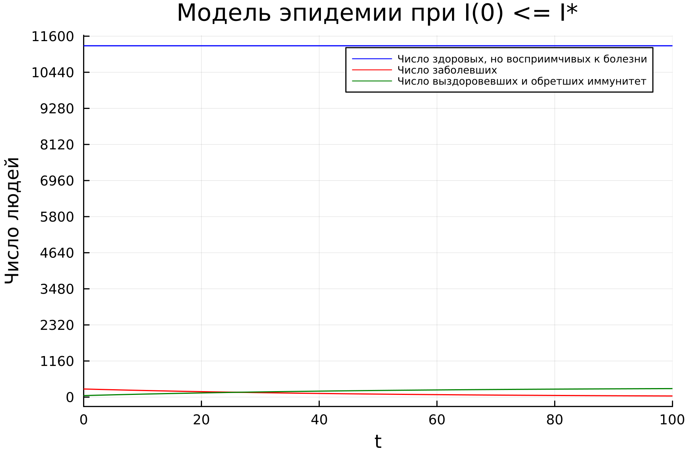
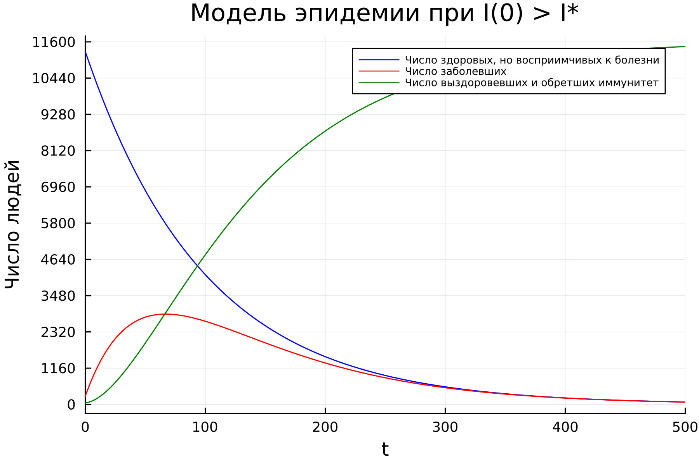

---
## Front matter
lang: ru-RU
title: Лабораторная работа №6
subtitle: Математическое моделирование
author:
  - Николаев Д. И.
institute:
  - Российский университет дружбы народов, Москва, Россия
date: 18 марта 2023

## i18n babel
babel-lang: russian
babel-otherlangs: english

## Formatting pdf
toc: false
toc-title: Содержание
slide_level: 2
aspectratio: 169
section-titles: true
theme: metropolis
header-includes:
 - \metroset{progressbar=frametitle,sectionpage=progressbar,numbering=fraction}
 - '\makeatletter'
 - '\beamer@ignorenonframefalse'
 - '\makeatother'
---

# Прагматика выполнения

- Ознакомление с простейшей моделью эпидемии;
- Обучение построению графиков изменения числа особей в группах с помощью Julia и OpenModelica;
- Примение полученных знаний на практике в дальнейшем.

# Цели

- Научиться работать с Julia и OpenModelica;
- Построить графики изменения числа особей в группах с помощью простейшей модели эпидемии;
- Рассмотреть протекание эпидемии в различных случаях;

# Простейшая модель эпидемии

Предположим, что некая популяция, состоящая из $N$ особей, (считаем, что популяция изолирована) подразделяется на три группы. Первая группа --- это восприимчивые к болезни, но пока здоровые особи, обозначим их через $S(t)$. Вторая группа --- это число инфицированных особей, которые также при этом являются распространителями инфекции, обозначим их $I(t)$. А третья группа, обозначающаяся через $R(t)$ --- это здоровые особи с иммунитетом к болезни.

# Задачи

1. Решить систему дифференциальных уравнений динамики заболеваемости в простейшей модели эпидемии:
$$
\frac{dS}{dt}=\begin{cases} -\alpha S, если\ I(t)>I^*,\\
0, если\ I(t)\leq I^*
\end{cases} \qquad
\frac{\partial I}{\partial t}=\begin{cases}\alpha S-\beta I, если\ I(t)>I^*,\\
-\beta I, если\ I(t)\leq I^*
\end{cases} \qquad
\frac{\partial R}{\partial t}=\beta I
$$
2. Построить графики зависимости числа особей в трех группах в зависимости от времени протекания эпидемии при следующих начальных условиях: $N = 11600$ --- общее число особей; $I(0)=260$ --- начальное число инфицированных; $R(0) = 48$ --- начальное число здоровых с иммунитетом; $S(0)=N-I(0)- R(0) = 11292$ --- начальное число здоровых, но восприимчивых к болезни; $\alpha = 0.01$, $\beta = 0.02$ --- коэффициенты заболевания и выздоровления соответственно.
3. Рассмотреть протекание эпидемии в двух случаях:
    - Если $I(0) \leq I^*$
    - Если $I(0) > I^*$

# Полученные графики

## Модель эпидемии при начальном числе инфицированных не превышающем критического

{#fig:001 width=90%}

## Модель эпидемии при начальном числе инфицированных больше критического

{#fig:002 width=90%}

# Результаты

По результатам работы, я научился составлять системы дифференциальных уравнений динамики заболеваемости в простейшей модели эпидемии, построил графики изменения числа особей по трем группам и рассмотрел протекание эпидемии в двух различных случаях в языках Julia и OpenModelica.
