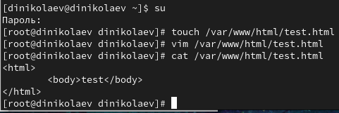
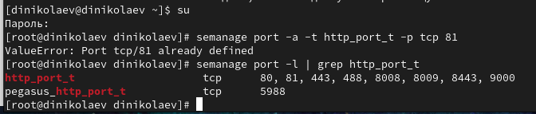

---
## Front matter
lang: ru-RU
title: Лабораторная работа №6
subtitle: Информационная безопасность
author:
  - Николаев Д. И.
institute:
  - Российский университет дружбы народов, Москва, Россия
date: 6 октября 2023

## i18n babel
babel-lang: russian
babel-otherlangs: english

## Formatting pdf
toc: false
toc-title: Содержание
slide_level: 2
aspectratio: 169
section-titles: true
theme: metropolis
header-includes:
 - \metroset{progressbar=frametitle,sectionpage=progressbar,numbering=fraction}
 - '\makeatletter'
 - '\beamer@ignorenonframefalse'
 - '\makeatother'
---

# Прагматика выполнения

- Повышение навыков администрирования ОС Linux;
- Знакомство с технологией SELinux и проверка ее работы на практике совместно с веб-сервером Apache;
- Применение полученных знаний на практике в дальнейшем.

# Цели

- Развить навыки администрирования ОС Linux. Получить первое практическое знакомство с технологией SELinux.
- Проверить работу SELinux на практике совместно с веб-сервером Apache.

# Задачи

1. Ознакомиться с технологией SELinux;
2. Проверить работу SELinux в связке с веб-сервисом Apache.

# Выполнение работы

## Установка SetUID-бита

SetUID разрешает пользователям запускать исполняемые файлы с правами владельца исполняемого файла.

{#fig:007 width=70%}

## Результат установки SetUID-бита 1

{#fig:014 width=70%}

## Результат установки SetUID-бита 2

{#fig:015 width=70%}

## Sticky-бит

В случае, если этот бит установлен для папки, то файлы в этой папке могут быть удалены только их владельцем.

{#fig:016 width=70%}

## Результат применения Sticky-бита

{#fig:018 width=70%}

## Результат при отсутствии Sticky-бита

{#fig:019 width=70%}

# Результаты

По результатам работы, я развил навыки администрирования ОС Linux, получил первое практическое знакомство с технологией SELinux и проверил работу SELinux на практике совместно с веб-сервером Apache.
