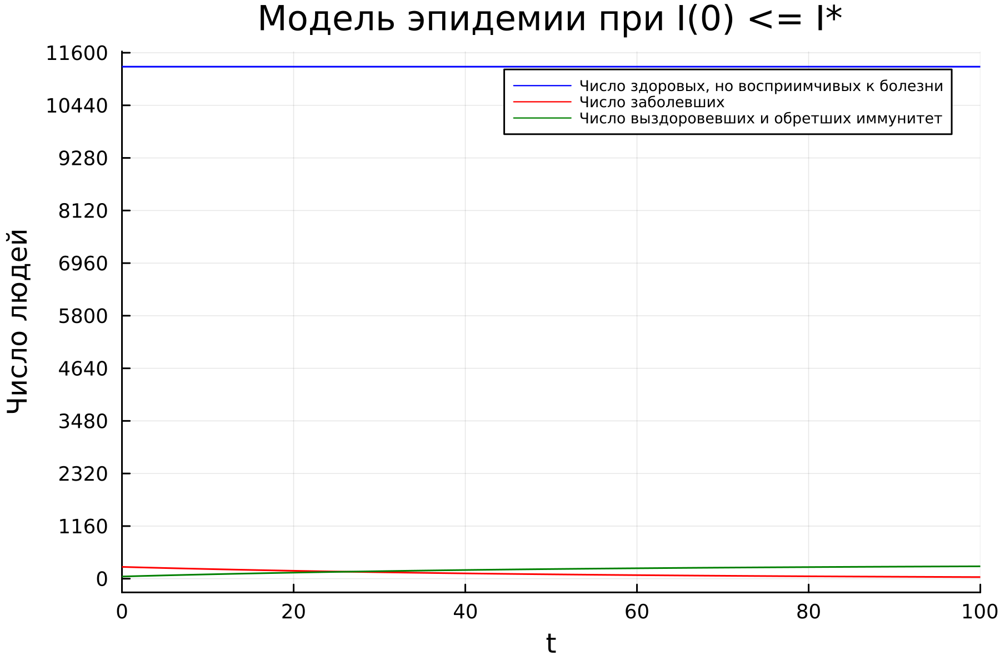
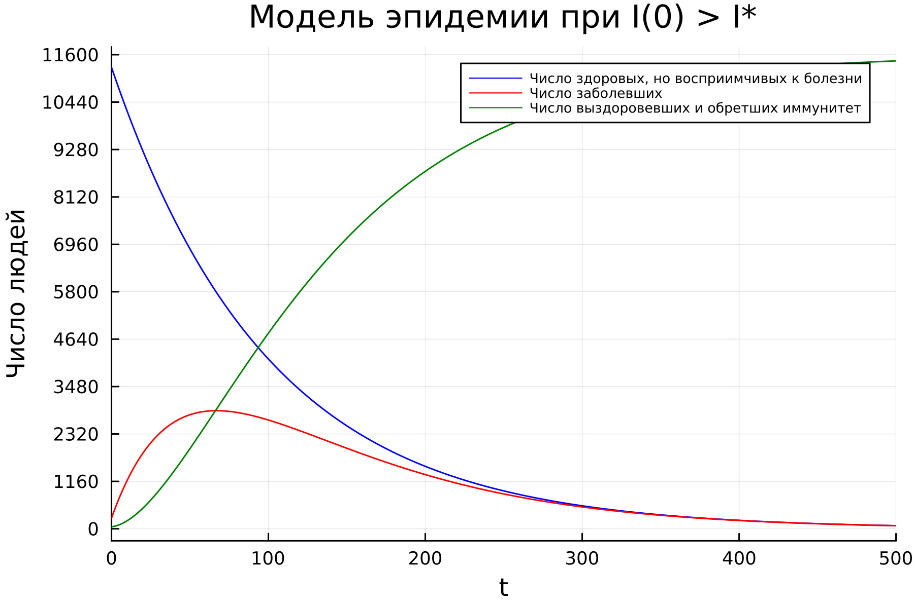
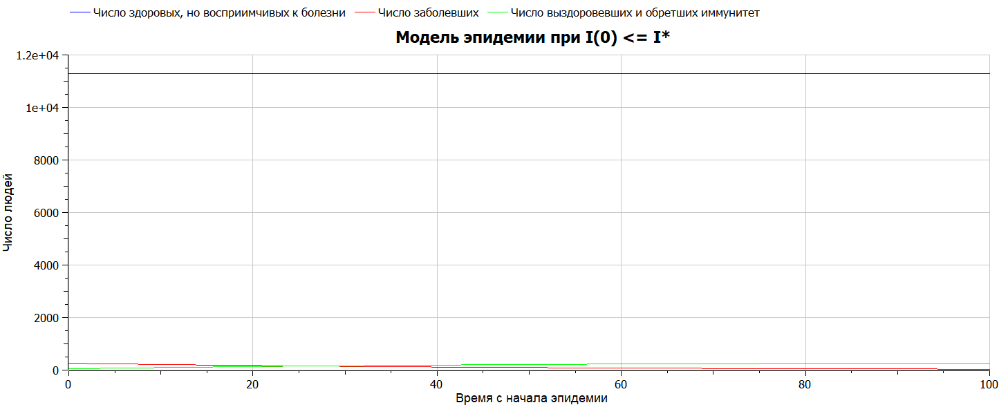
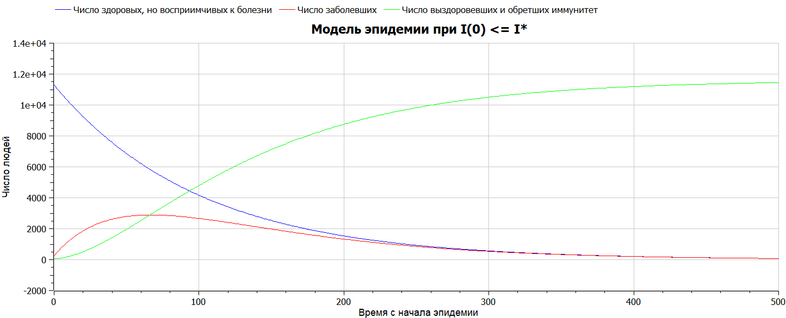

---
## Front matter
title: "Лабораторная работа №6"
subtitle: "Математическое моделирование"
author: "Николаев Дмитрий Иванович"

## Generic otions
lang: ru-RU
toc-title: "Содержание"

## Bibliography
bibliography: bib/cite.bib
csl: pandoc/csl/gost-r-7-0-5-2008-numeric.csl

## Pdf output format
toc: true # Table of contents
toc-depth: 2
lof: true # List of figures
lot: true # List of tables
fontsize: 12pt
linestretch: 1.5
papersize: a4
documentclass: scrreprt
## I18n polyglossia
polyglossia-lang:
  name: russian
  options:
	- spelling=modern
	- babelshorthands=true
polyglossia-otherlangs:
  name: english
## I18n babel
babel-lang: russian
babel-otherlangs: english
## Fonts
mainfont: PT Serif
romanfont: PT Serif
sansfont: PT Sans
monofont: PT Mono
mainfontoptions: Ligatures=TeX
romanfontoptions: Ligatures=TeX
sansfontoptions: Ligatures=TeX,Scale=MatchLowercase
monofontoptions: Scale=MatchLowercase,Scale=0.9
## Biblatex
biblatex: true
biblio-style: "gost-numeric"
biblatexoptions:
  - parentracker=true
  - backend=biber
  - hyperref=auto
  - language=auto
  - autolang=other*
  - citestyle=gost-numeric
## Pandoc-crossref LaTeX customization
figureTitle: "Рис."
tableTitle: "Таблица"
listingTitle: "Листинг"
lofTitle: "Список иллюстраций"
lotTitle: "Список таблиц"
lolTitle: "Листинги"
## Misc options
indent: true
header-includes:
  - \usepackage{indentfirst}
  - \usepackage{float} # keep figures where there are in the text
  - \floatplacement{figure}{H} # keep figures where there are in the text
---

# Цель работы

Проанализировать простейшую модель эпидемии, построить графики изменения числа людей в группах (заболевшие; здоровые, но восприимчивые; выздоровевшие и обретшие иммунитет) с помощью данной модели эпидемии, рассмотреть, как будет протекать эпидемия в различных случаях.

# Задание

Вариант 29

На одном острове вспыхнула эпидемия. Известно, что из всех проживающих на острове ($N = 11600$) в момент начала эпидемии ($t = 0$) число заболевших людей (являющихся распространителями инфекции) $I(0)=260$, А число здоровых людей с иммунитетом к болезни $R(0) = 48$. Таким образом, число людей восприимчивых к болезни, но пока здоровых, в начальный момент времени $S(0)=N-I(0)- R(0)$. Постройте графики изменения числа особей в каждой из трех групп. Рассмотрите, как будет протекать эпидемия в случае:

1. Если $I(0) \leq I^*$
2. Если $I(0) > I^*$

# Теоретическое введение

Предположим, что некая популяция, состоящая из $N$ особей, (считаем, что популяция изолирована) подразделяется на три группы. Первая группа --- это восприимчивые к болезни, но пока здоровые особи, обозначим их через $S(t)$. Вторая группа –-- это число инфицированных особей, которые также при этом являются распространителями инфекции, обозначим их через $I(t)$. А третья группа, обозначающаяся через $R(t)$ –-- это здоровые особи с иммунитетом к болезни.

До того, как число заболевших не превышает критического значения $I^*$ ($I(t) \leq I^*$), считаем, что все больные изолированы и не заражают здоровых. Когда $I(t)>I^*$, тогда инфицирование способны заражать восприимчивых к болезни особей. Таким образом, скорость изменения числа $S(t)$ меняется по следующему закону:
$$
\frac{dS}{dt}=\begin{cases} -\alpha S, если\ I(t)>I^*,\\
0, если\ I(t)\leq I^*
\end{cases}
$$
Поскольку каждая восприимчивая к болезни особь, которая, в конце концов, заболевает, сама становится инфекционной, то скорость изменения числа инфекционных особей представляет разность за единицу времени между заразившимися и теми, кто уже болеет и лечится, т.е.:
$$
\frac{\partial I}{\partial t}=\begin{cases}\alpha S-\beta I, если\ I(t)>I^*,\\
-\beta I, если\ I(t)\leq I^*
\end{cases}
$$
А скорость изменения выздоравливающих особей (при этом приобретающие иммунитет к болезни):
$$
\frac{\partial R}{\partial t}=\beta I
$$
Постоянные пропорциональности $\alpha$, $\beta$ это коэффициенты заболеваемости и выздоровления соответственно. ([@lab6])

Для того, чтобы решения соответствующих уравнений определялось однозначно, необходимо задать начальные условия. Считаем, что на начало эпидемии в момент времени $t=0$ Число особей с иммунитетом к болезни $R(0)=R_0$, а число инфицированных и восприимчивых к болезни особей $I(0) = I_0$ и $S(0) = S_0$ соответственно. Для анализа картины протекания эпидемии необходимо рассмотреть два случая:
$$
I(0)>I^*;I(0)\leq I^*
$$

# Выполнение лабораторной работы

## Постановка задачи

Рассмотрим предложенную простейшую модель эпидемии для двух случаев:

1. Когда начальное число инфицированных не превышает некоторого критического значения.
2. Когда начальное число инфицированных больше некоторого критического значения.

Моделировать будем в предположении, что коэффициент заболеваемости ниже коэффициента выздоровления, а именно, примем $\alpha = 0.01$, $\beta = 0.02$.

## Реализация на Julia

- Динамика численности здоровых, инфицированных и выздоровевших с обретением иммунитета при начальном числе инфицированных меньше или равному критическому (Рис. [@fig:001]).
- Динамика численности здоровых, инфицированных и выздоровевших с обретением иммунитета при начальном числе инфицированных больше критического (Рис. [@fig:002]).

Код на Julia:

```julia
using Plots
using DifferentialEquations

const N = 11600;    # Число проживающих на острове
const I0 = 260;  # Число изначально заболевших
const R0 = 48;   # Число здоровых с иммунитетом
const S0 = N - I0 - R0;   # Число здоровых, но восприимчивых к болезни
const a = 0.01; # Коэффициент заболеваемости
const b = 0.02; # Коэффициент выздоровления

# u[1] - S(t), u[2] - I(t), u[3] - R(t), 
#где S - Число здоровых, но восприимчивых к болезни, 
#I - Число заболевших, R - число выздоровевших (при этом приобретая иммунитет) 
#du[1]=dS/dt, du[2]=dI/dt, du[3]=dR/dt
"Модель эпидемии при I(0) <= I*"
function lorenz1!(du,u,p,t)
    du[1] = 0
    du[2] = -b*u[2]
    du[3] = b*u[2]
end
"Модель эпидемии при I(0) > I*"
function lorenz2!(du,u,p,t)
    du[1] = -a*u[1]
    du[2] = a*u[1] - b*u[2]
    du[3] = b*u[2]
end

const u0 = [S0, I0, R0]
const T = [0.0, 100.0]
const T2 = [0.0, 500.0]

prob1 = ODEProblem(lorenz1!, u0, T)
prob2 = ODEProblem(lorenz2!, u0, T2)

sol1 = solve(
    prob1,
    abstol=1e-8,
    reltol=1e-8)
sol2 = solve(
    prob2,
    abstol=1e-8,
    reltol=1e-8)

plt1 = plot(
    dpi=300,
    legend=true)
plot!(
    plt1,
    sol1,
    idxs=(0,1),
    label="Число здоровых, но восприимчивых к болезни",
    xlabel="Время с начала эпидемии",
    ylabel="Число людей",
    yticks = 0:1160:11600, 
    formatter=:plain,
    legend_position=:topright,
    titlefontsize=:14,
    legend_font_pointsize=:6,
    color=:blue,
    title="Модель эпидемии при I(0) <= I*")
plot!(
    plt1,
    sol1,
    idxs=(0,2),
    label="Число заболевших",
    color=:red)
plot!(
    plt1,
    sol1,
    idxs=(0,3),
    label="Число выздоровевших и обретших иммунитет", 
    color=:green)

plt2 = plot(
    dpi=300,
    legend=true)
plot!(
    plt2,
    sol2,
    idxs=(0,1),
    label="Число здоровых, но восприимчивых к болезни",
    xlabel="Время с начала эпидемии",
    ylabel="Число людей",
    yticks = 0:1160:11600, 
    formatter=:plain,
    legend_position=:topright,
    titlefontsize=:14,
    legend_font_pointsize=:6,
    color=:blue,
    title="Модель эпидемии при I(0) > I*")
plot!(
    plt2,
    sol2,
    idxs=(0,2),
    label="Число заболевших",
    color=:red)
plot!(
    plt2,
    sol2,
    idxs=(0,3),
    label="Число выздоровевших и обретших иммунитет", 
    color=:green)

savefig(plt1, "image/lab06_1.png")
savefig(plt2, "image/lab06_2.png")
```

## Реализация на OpenModelica

- Динамика численности здоровых, инфицированных и выздоровевших с обретением иммунитета при начальном числе инфицированных меньше или равному критическому (Рис. [@fig:003]).
- Динамика численности здоровых, инфицированных и выздоровевших с обретением иммунитета при начальном числе инфицированных больше критического (Рис. [@fig:004]).

Код на OpenModelica:

Первая модель эпидемии при начальном числе инфицированных меньше или равному критическому:

```OpenModelica
model epidemy1
constant Real a = 0.01;//коэффицент заболевания
constant Real b = 0.02;//коэфицент выздоровления 
constant Real N = 11600;//количество проживающих на острове
Real S;
Real I;
Real R;
initial equation
  I = 260;
  R = 48;
  S = N - I - R;
equation
  der(S) = 0;
  der(I) = -b*I;
  der(R) = b*I;
end epidemy1;
```

Вторая модель эпидемии при начальном числе инфицированных больше критического:

```OpenModelica
model epidemy2
constant Real a = 0.01;//коэффицент заболевания
constant Real b = 0.02;//коэфицент выздоровления 
constant Real N = 11600;//количество проживающих на острове
Real S;
Real I;
Real R;
initial equation
  I = 260;
  R = 48;
  S = N - I - R;
equation
  der(S) = -a*S;
  der(I) = a*S - b*I;
  der(R) = b*I;
end epidemy2;
```

## Полученные графики

{#fig:001 width=90%}

{#fig:002 width=90%}

{#fig:003 width=90%}

{#fig:004 width=90%}

# Выводы

В ходе выполнения лабораторной работы я научился строить графики изменения числа людей в группах с помощью простейшей модели эпидемии, рассмотрел, как будет протекать эпидемия в различных случаях.

# Список литературы{.unnumbered}

::: {#refs}
:::
