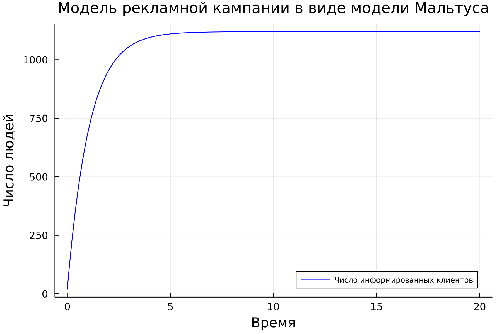
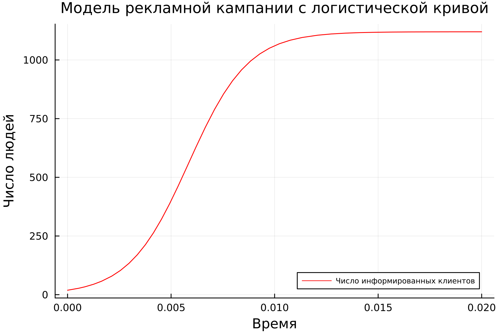
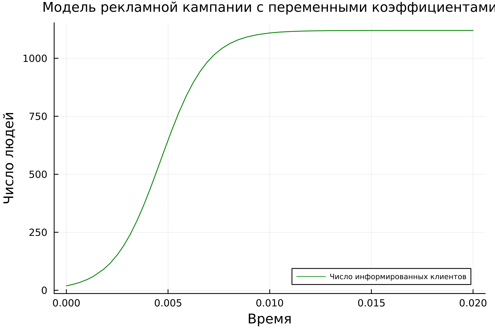
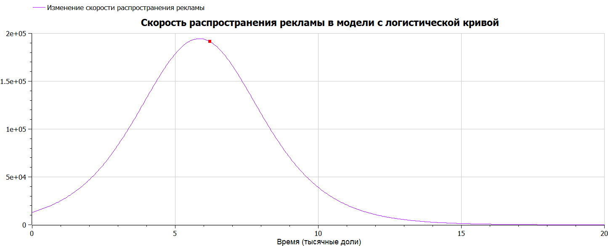

---
## Front matter
lang: ru-RU
title: Лабораторная работа №7
subtitle: Математическое моделирование
author:
  - Николаев Д. И.
institute:
  - Российский университет дружбы народов, Москва, Россия
date: 24 марта 2023

## i18n babel
babel-lang: russian
babel-otherlangs: english

## Formatting pdf
toc: false
toc-title: Содержание
slide_level: 2
aspectratio: 169
section-titles: true
theme: metropolis
header-includes:
 - \metroset{progressbar=frametitle,sectionpage=progressbar,numbering=fraction}
 - '\makeatletter'
 - '\beamer@ignorenonframefalse'
 - '\makeatother'
---

# Прагматика выполнения

- Ознакомление с простейшей моделью эффективности рекламы;
- Обучение построению графиков распространения рекламы с помощью Julia и OpenModelica;
- Примение полученных знаний на практике в дальнейшем.

# Цели

- Научиться работать с Julia и OpenModelica;
- Построение решения распространения информации о товаре, учитывая вклад платной рекламы; вклад "сарафанного радио"; вклад обеих компонент, зависимых от времени;
- Научиться определять в какой момент времени скорость распространения рекламы будет иметь максимальное значение для случая с наибольшим вкладом "сарафанного радио" (логистическая кривая).

# Модель распространения рекламы

Математическая модель распространения рекламы описывается уравнением:
$$
\frac{dn}{dt}=(\alpha_1(t)+\alpha_2(t)n(t))(N-n(t)),
$$
где $N$ --- общее число потенциальных платежеспособных покупателей, $\alpha_1(t)>0$ характеризует интенсивность рекламной кампании (зависит от затрат на рекламу в данный момент времени), $\alpha_2(t)n(t)(N-n(t))$ --- вклад узнавших о товаре потребителей, которые сами распространяют информацию среди потенциальных покупателей.

Причём при $\alpha_{1} \gg \alpha_{2}$ имеем модель Мальтуса (экспоненциальный рост), а при $\alpha_{1} \ll \alpha_{2}$ --- логистическую кривую.

# Задачи

Построить графики зависимости информированности покупателей в зависимости от времени начала рекламной кампании в трех случаях, математические модели которых описываются следующими уравнениями:

1. Модель Мальтуса:
$$
\frac{dn}{dt} = (0.93 + 0.00003 n(t))(N - n(t))
$$
2. Модель с логистической кривой, для которой определить в какой момент времени скорость распространения рекламы будет иметь максимальное значение:
$$
\frac{dn}{dt} = (0.00003 + 0.62 n(t))(N - n(t))
$$
3. Модель с переменными коэффициентами:
$$
\frac{dn}{dt} = (0.88 \cos(t) + 0.77 \cos(2t) n(t))(N - n(t))
$$
Где $N = 1120$ --- общее число потенциальных покупателей; $n_0 = 19$ --- начальное число информированных.

# Полученные графики

## Изменение числа информированных покупателей в модели Мальтуса

{#fig:001 width=110% height=80%}

## Изменение числа информированных покупателей в модели с логистической кривой

{#fig:002 width=110% height=80%}

## Изменение числа информированных покупателей в третьем случае

{#fig:003 width=110% height=80%}

# Момент наибольшей скорости распространения рекламы

Эффективность рекламы во второй модели будет иметь максимально быстрый рост в точке наибольшего значения производной.
Получим, что момент наибыстрейшего роста числа информированных клиентов во второй модели $t = 0.005751316737428766$.

{#fig:004 width=100% height=90%}

# Результаты

По результатам работы, я научился составлять системы дифференциальных уравнений распространения рекламы в трех случаях с различным вкладом самой рекламы и "сарафанного радио", определил момент наибольшей скорости распространения рекламы в модели с логистической кривой ($\alpha_{1} \ll \alpha_{2}$) в языках Julia и OpenModelica.
