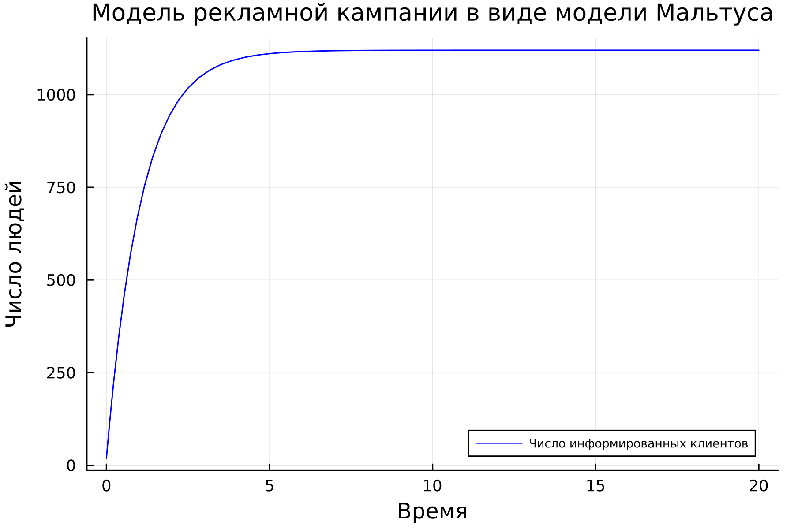
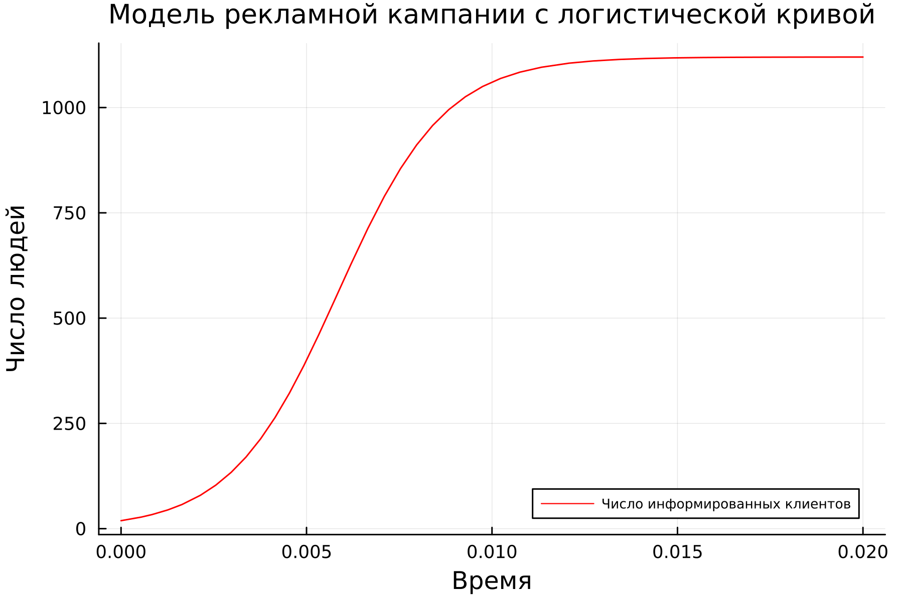
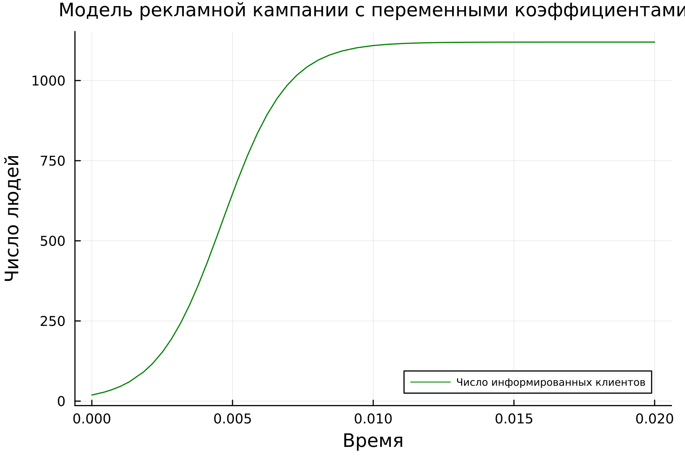
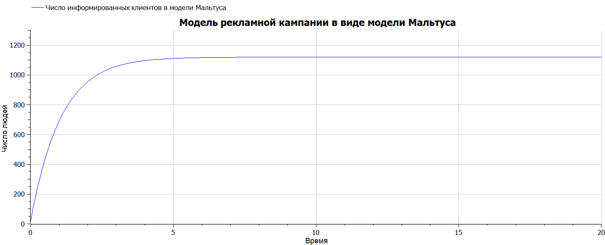
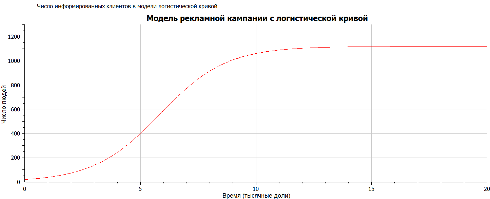
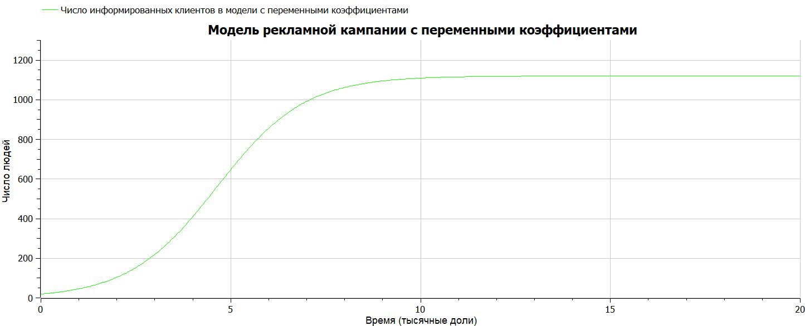
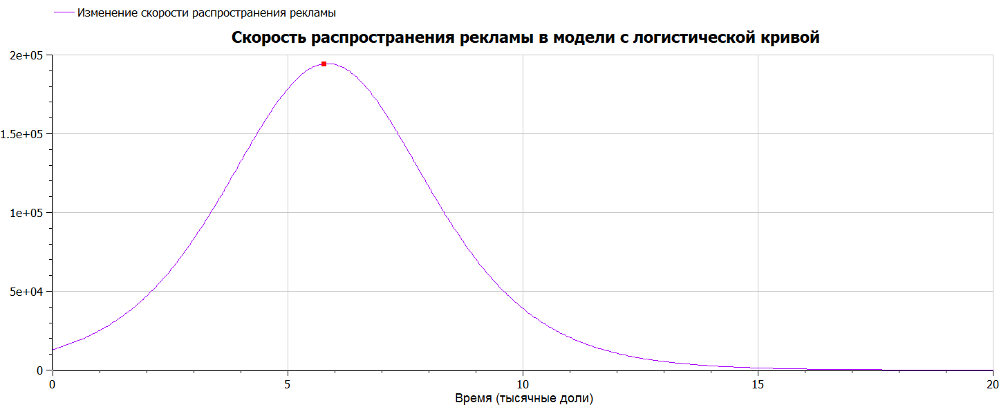

---
## Front matter
title: "Лабораторная работа №7"
subtitle: "Математическое моделирование"
author: "Николаев Дмитрий Иванович"

## Generic otions
lang: ru-RU
toc-title: "Содержание"

## Bibliography
bibliography: bib/cite.bib
csl: pandoc/csl/gost-r-7-0-5-2008-numeric.csl

## Pdf output format
toc: true # Table of contents
toc-depth: 2
lof: true # List of figures
lot: true # List of tables
fontsize: 12pt
linestretch: 1.5
papersize: a4
documentclass: scrreprt
## I18n polyglossia
polyglossia-lang:
  name: russian
  options:
	- spelling=modern
	- babelshorthands=true
polyglossia-otherlangs:
  name: english
## I18n babel
babel-lang: russian
babel-otherlangs: english
## Fonts
mainfont: PT Serif
romanfont: PT Serif
sansfont: PT Sans
monofont: PT Mono
mainfontoptions: Ligatures=TeX
romanfontoptions: Ligatures=TeX
sansfontoptions: Ligatures=TeX,Scale=MatchLowercase
monofontoptions: Scale=MatchLowercase,Scale=0.9
## Biblatex
biblatex: true
biblio-style: "gost-numeric"
biblatexoptions:
  - parentracker=true
  - backend=biber
  - hyperref=auto
  - language=auto
  - autolang=other*
  - citestyle=gost-numeric
## Pandoc-crossref LaTeX customization
figureTitle: "Рис."
tableTitle: "Таблица"
listingTitle: "Листинг"
lofTitle: "Список иллюстраций"
lotTitle: "Список таблиц"
lolTitle: "Листинги"
## Misc options
indent: true
header-includes:
  - \usepackage{indentfirst}
  - \usepackage{float} # keep figures where there are in the text
  - \floatplacement{figure}{H} # keep figures where there are in the text
---

# Цель работы

Построить графики распространения рекламы для трех случаев: модель Мальтуса, модель с логистической кривой, модель с переменными коэффициентами. Определить в какой момент времени скорость распространения рекламы будет иметь максимальное значение.

# Задание

Вариант 29

Постройте график распространения рекламы, математическая модель которой описывается следующим уравнением:

1. Модель Мальтуса:
$$
\frac{dn}{dt} = (0.93 + 0.00003 n(t))(N - n(t))
$$
2. Модель с логистической кривой:
$$
\frac{dn}{dt} = (0.00003 + 0.62 n(t))(N - n(t))
$$
3. Модель с переменными коэффициентами:
$$
\frac{dn}{dt} = (0.88 \cos(t) + 0.77 \cos(2t) n(t))(N - n(t))
$$

При этом объем аудитории $N = 1120$, в начальный момент о товаре знает 19 человек ($n_0 = 19$). Для случая 2 определите в какой момент времени скорость распространения рекламы будет иметь максимальное значение.

# Теоретическое введение

Организуется рекламная кампания нового товара или услуги. Необходимо, чтобы прибыль будущих продаж с избытком покрывала издержки на рекламу. Вначале расходы могут превышать прибыль, поскольку лишь малая часть потенциальных покупателей будет информирована о новинке. Затем, при увеличении числа продаж, возрастает и прибыль, и, наконец, наступит момент, когда рынок насытиться, и рекламировать товар станет бесполезным.

Предположим, что торговыми учреждениями реализуется некоторая продукция, о которой в момент времени $t$ из числа потенциальных покупателей $N$ знает лишь $n$ покупателей. Для ускорения сбыта продукции запускается реклама по радио, телевидению и других средств массовой информации. После запуска рекламной кампании информация о продукции начнет распространяться среди потенциальных покупателей путем общения друг с другом. Таким образом, после запуска рекламных объявлений скорость изменения числа знающих о продукции людей пропорциональна как числу знающих о товаре покупателей, так и числу покупателей о нем незнающих [@lab7].

Модель рекламной кампании описывается следующими величинами. Считаем, что $\frac{dn}{dt}$ --- скорость изменения со временем числа потребителей, узнавших о товаре и готовых его купить, $t$ --- время, прошедшее с начала рекламной кампании, $n(t)$ --- число уже информированных клиентов. Эта величина пропорциональна числу покупателей, еще не знающих о нем, это описывается следующим образом:
$$
\alpha_1(t)(N-n(t)),
$$
где $N$ - общее число потенциальных платежеспособных покупателей, $\alpha_1(t)>0$ характеризует интенсивность рекламной кампании (зависит от затрат на рекламу в данный момент времени). Помимо этого, узнавшие о товаре потребители также распространяют полученную информацию среди потенциальных покупателей, не знающих о нем (в этом случае работает т.н. сарафанное радио). Этот вклад в рекламу описывается величиной
$$
\alpha_2(t)n(t)(N-n(t)),
$$
эта величина увеличивается с увеличением потребителей узнавших о товаре. Математическая модель распространения рекламы описывается уравнением:
$$
\frac{dn}{dt}=(\alpha_1(t)+\alpha_2(t)n(t))(N-n(t)).
$$

Мальтузианская модель роста, также называемая моделью Мальтуса --- это экспоненциальный рост с постоянным темпом. Модель названа в честь английского демографа и экономиста Томаса Мальтуса. Мальтузианские модели выглядят следующим образом:
$$
N(t) = N_0e^{rt},
$$
где

- $N_0 = N(0)$ --- исходная численность населения,
- $r$ --- темп прироста населения («мальтузианский параметр»),
- $t$ --- время.

Иначе модель называют простой экспоненциальной, экспоненциальным законом или мальтузианским законом. Он широко используется в популяционной экологии как первый принцип популяционной динамики [@Maltus].

Модель роста населения в условиях ограниченности ресурсов построил Пьер Франсуа Ферхюльст (1838), вдохновившийся теорией Мальтуса. Соответствующий математический объект был назван логистической функцией. Логистическое уравнение изначально появилось при изучении изменений численности населения.

Исходные предположения для вывода уравнения при рассмотрении популяционной динамики выглядят следующим образом:

- Скорость размножения популяции пропорциональна её текущей численности, при прочих равных условиях;
- Скорость размножения популяции пропорциональна количеству доступных ресурсов, при прочих равных условиях. Таким образом, второй член уравнения отражает конкуренцию за ресурсы, которая ограничивает рост популяции.
Обозначая через $N$ численность популяции, а время --- $t$, модель можно свести к дифференциальному уравнению:
$$
\frac{dN}{dt} = rN(1 - \frac{N}{K}),
$$
где параметр $r$ характеризует скорость роста (размножения), а $K$ --- поддерживающую ёмкость среды (то есть, максимально возможную численность популяции). Исходя из названия коэффициентов, в экологии часто различают две стратегии поведения видов:

- $r$-стратегия предполагает бурное размножение и короткую продолжительность жизни особей;
- $K$-стратегия --- низкий темп размножения и долгую жизнь.

Точным решением уравнения (где $N_0$ --- начальная численность популяции) является логистическая функция, S-образная кривая (логистическая кривая):
$$
N(t) = \frac{KN_0e^{rt}}{K + N_0(e^{rt} - 1)},
$$
где
$$
\lim_{t \to \infty} N(t) = K.
$$
Ясно, что в ситуации «достаточного объёма ресурсов», то есть пока $N(t)$ много меньше $K$, логистическая функция поначалу растёт приблизительно экспоненциально:
$$
\frac{N(t)}{N_0e^{rt}} = \frac{K}{K + N_0(e^{rt}-1)} = \frac{1}{1 + \frac{N_0}{K} (e^{rt}-1)}.
$$
Аналогично, при «исчерпании ресурсов» ($t \to \infty$) разность $K - N(t)$ экспоненциально убывает с таким же показателем [@Logistic_curve].

# Выполнение лабораторной работы

## Постановка задачи

Построить графики изменения числа информированных покупателей в зависимости от времени с начала рекламной кампании в трех различных случаях: $\alpha_{1} \gg \alpha_{2}$, дающий нам модель Мальтуса; $\alpha_{1} \ll \alpha_{2}$, дающий нам логистическую кривую и $\alpha_{2} (t)$ и $\alpha_{1} (t)$ с переменными коэффициентами.

## Реализация на Julia

- Изменение числа информированных покупателей в модели Мальтуса, т.е. при $\alpha_{1} \gg \alpha_{2}$ (Рис. [@fig:001]).
- Изменение числа информированных покупателей в модели с логистической кривой, т.е. при $\alpha_{1} \ll \alpha_{2}$ (Рис. [@fig:002]).
- Изменение числа информированных покупателей в модели с переменными коэффициентами, т.е. при $\alpha_{2} (t)$ и $\alpha_{1} (t)$ (Рис. [@fig:003]).

Код на Julia:

```julia
using Plots
using DifferentialEquations

const N = 1120;    # Число проживающих на острове
const n0 = 19

const a1_1 = 0.93; # Интенсивность рекламной кампании 
#в первом случае(модель Мальтуса)
const a2_1 = 0.00003; # Эффективность распространения 
#за счет осведомленных в первом случае
const a1_2 = 0.00003; # Интенсивность рекламной кампании 
#во втором случае(логистическая кривая)
const a2_2 = 0.62; # Эффективность распространения 
#за счет осведомленных во втором случае
"Интенсивность рекламной кампании в третьем случае"
function a1_3(t)
    0.88*cos(t)
end
"Эффективность распространения за счет осведомленных в третьем случае"
function a2_3(t)
    0.77*cos(2*t)
end

"Модель Мальтуса"
function F_1(u, p, t)
    return (a1_1 + a2_1*u)*(N - u)
end
"Модель с логистической кривой"
function F_2(u, p, t)
    return (a1_2 + a2_2*u)*(N - u)
end
"Третий случай с зависимыми от времени коэффициентами"
function F_3(u, p, t)
    return (a1_3(t) + a2_3(t)*u)*(N - u)
end

const u0 = n0
const T_1 = [0.0, 20.0]
const T_2 = [0.0, 0.02]
const T_3 = [0.0, 0.02]

prob1 = ODEProblem(F_1, u0, T_1)
prob2 = ODEProblem(F_2, u0, T_2)
prob3 = ODEProblem(F_3, u0, T_3)

sol1 = solve(
    prob1,
    abstol=1e-8,
    reltol=1e-8)
sol2 = solve(
    prob2,
    abstol=1e-8,
    reltol=1e-8)
sol3 = solve(
    prob3,
    abstol=1e-8,
    reltol=1e-8)    

function F2(u)
    return (a1_2 + a2_2*u)*(N - u)
end
F = collect(F2(u) for u in sol2.u) # Набор значений производной
k = argmax(F) #Индекс наибольшего значения, т.е. sol2.u[k]
t1 = sol2.t[k] # Время для найденного индекса
println("Момент наибыстрейшего роста числа 
информированных клиентов во второй модели t = ", t1)

plt1 = plot(
    dpi=300,
    legend=true)
plot!(
    plt1,
    sol1.t,
    sol1.u,
    label="Число информированных клиентов",
    xlabel="Время",
    ylabel="Число людей",
    legend_position=:bottomright,
    titlefontsize=:12,
    legend_font_pointsize=:6,
    color=:blue,
    title="Модель рекламной кампании в виде модели Мальтуса")

plt2 = plot(
    dpi=300,
    legend=true)
plot!(
    plt2,
    sol2.t,
    sol2.u,
    label="Число информированных клиентов",
    xlabel="Время",
    ylabel="Число людей",
    legend_position=:bottomright,
    titlefontsize=:12,
    legend_font_pointsize=:6,
    color=:red,
    title="Модель рекламной кампании с логистической кривой")

plt3 = plot(
    dpi=300,
    legend=true)
plot!(
    plt3,
    sol3.t,
    sol3.u,
    label="Число информированных клиентов",
    xlabel="Время",
    ylabel="Число людей",
    legend_position=:bottomright,
    titlefontsize=:11,
    legend_font_pointsize=:6,
    color=:green,
    title="Модель рекламной кампании с переменными коэффициентами")

savefig(plt1, "image/lab07_1.png")
savefig(plt2, "image/lab07_2.png")
savefig(plt3, "image/lab07_3.png")
```

Эффективность рекламы во второй модели будет иметь максимально быстрый рост в точке наибольшего значения производной. Следующая часть кода находит это значение:

```julia
function F2(u)
    return (a1_2 + a2_2*u)*(N - u)
end
F = collect(F2(u) for u in sol2.u) # Набор значений производной
k = argmax(F) #Индекс наибольшего значения, т.е. sol2.u[k]
t1 = sol2.t[k] # Время для найденного индекса
println("Момент наибыстрейшего роста числа 
информированных клиентов во второй модели t = ", t1)
```

Получим, что момент наибыстрейшего роста числа информированных клиентов во второй модели $t = 0.005751316737428766$.

## Реализация на OpenModelica

- Изменение числа информированных покупателей в модели Мальтуса, т.е. при $\alpha_{1} \gg \alpha_{2}$ (Рис. [@fig:004]).
- Изменение числа информированных покупателей в модели с логистической кривой, т.е. при $\alpha_{1} \ll \alpha_{2}$ (Рис. [@fig:005]).
- Изменение числа информированных покупателей в модели с переменными коэффициентами, т.е. при $\alpha_{2} (t)$ и $\alpha_{1} (t)$ (Рис. [@fig:006]).

Код на OpenModelica:

Модель Мальтуса, где $\alpha_{1} \gg \alpha_{2}$:

```OpenModelica
model Maltus
constant Real a1 = 0.93;//значение коэффициента a1
constant Real a2 = 0.00003;//значение коэффициента a2
constant Integer N = 1120;// число потенциальных покупателей
Real n;//количество информированных 
initial equation 
n = 19; // Первоначальное число информированных
equation 
der(n)=(a1 + a2*n)*(N - n);
end Maltus;
```

Модель с логистической кривой, где $\alpha_{1} \ll \alpha_{2}$:

```OpenModelica
model Logistic_curve
constant Real a1 = 0.00003;//значение коэффициента a1
constant Real a2 = 0.62;//значение коэффициента a2
constant Integer N = 1120;// число потенциальных покупателей
Real n;//количество информированных 
initial equation 
n = 19; // Первоначальное число информированных
equation 
der(n)=(a1 + a2*n)*(N - n);
end Logistic_curve;
```

Модель с переменными коэффициентами, где $\alpha_{2} (t)$ и $\alpha_{1} (t)$:

```OpenModelica
model Variant_coef
Real a1;//значение коэффициента a1
Real a2;//значение коэффициента a2
constant Integer N = 1120;// число потенциальных покупателей
Real n;//количество информированных 
initial equation 
n = 19; // Первоначальное число информированных
equation
a1 = 0.88*cos(time);
a2 = 0.77*cos(2*time); 
der(n)=(a1 + a2*n)*(N - n);
end Variant_coef;
```

Продемонстрируем на графике, что момент наибольшей скорости распространения рекламы во второй модели совпадает с численно полученным в Julia. Для чего построим график изменения значений производной от числа информированных покупателей (Рис. [@fig:007]).

## Полученные графики

{#fig:001 width=90%}

{#fig:002 width=90%}

{#fig:003 width=90%}

{#fig:004 width=90%}

{#fig:005 width=90%}

{#fig:006 width=90%}

{#fig:007 width=90%}

# Выводы

В ходе выполнения лабораторной работы я научился строить графики распространения рекламы в случаях с разным отношением коэффициентов: модель Мальтуса, модель с логистической кривой, модель с переменными коэффициентами. Определил в какой момент времени скорость распространения рекламы в модели с логистической кривой будет иметь максимальное значение.

# Список литературы{.unnumbered}

::: {#refs}
:::
