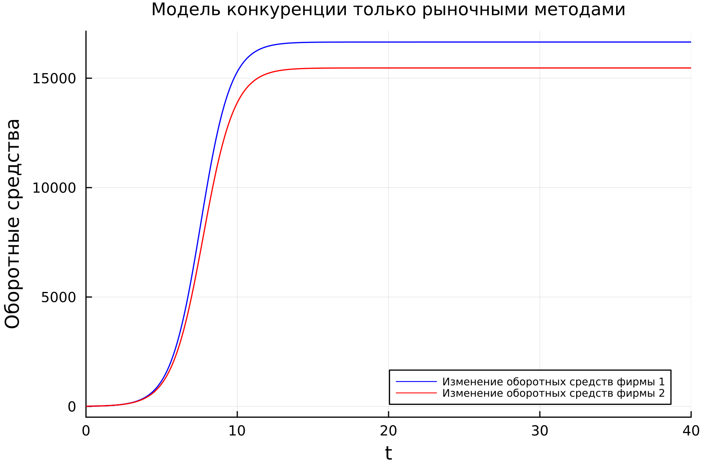
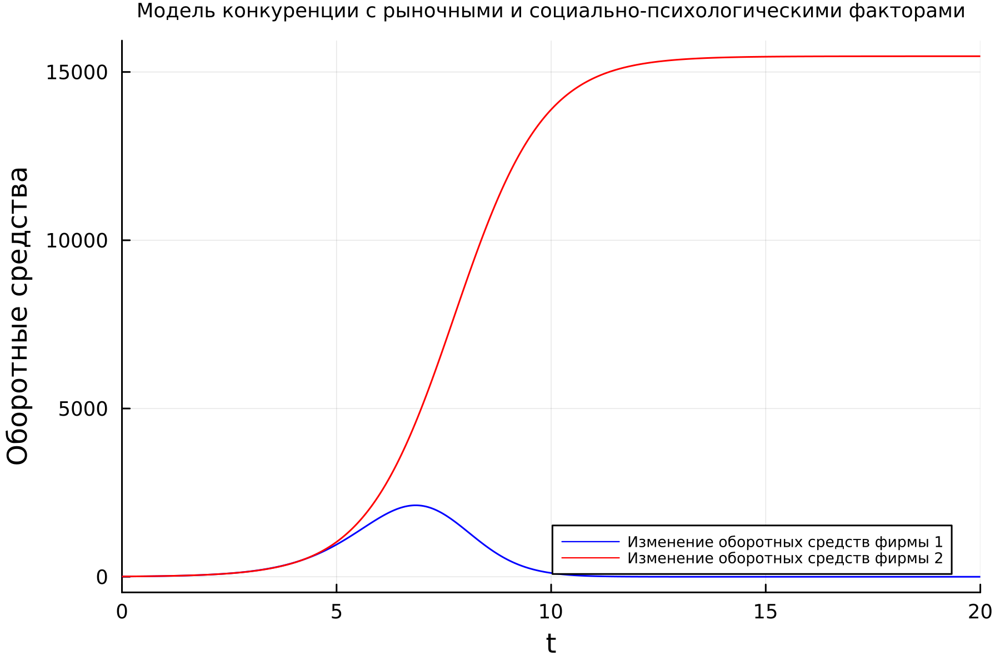

---
## Front matter
lang: ru-RU
title: Лабораторная работа №8
subtitle: Математическое моделирование
author:
  - Николаев Д. И.
institute:
  - Российский университет дружбы народов, Москва, Россия
date: 1 апреля 2023

## i18n babel
babel-lang: russian
babel-otherlangs: english

## Formatting pdf
toc: false
toc-title: Содержание
slide_level: 2
aspectratio: 169
section-titles: true
theme: metropolis
header-includes:
 - \metroset{progressbar=frametitle,sectionpage=progressbar,numbering=fraction}
 - '\makeatletter'
 - '\beamer@ignorenonframefalse'
 - '\makeatother'
---

# Прагматика выполнения

- Рассмотрение модели конкуренции двух фирм в двух случаях;
- Обучение построению графиков изменения оборотных средств с помощью Julia и OpenModelica;
- Примение полученных знаний на практике в дальнейшем.

# Цели

- Рассмотреть две фирмы, производящие взаимозаменяемые товары одинакового качества и находящиеся в одной рыночной нише с применением исключительно рыночные методы конкуренции;
- Рассмотреть модель, когда, помимо экономического фактора влияния, используются еще и социально-психологические факторы --- формирование общественного предпочтения одного товара другому, не зависимо от их качества и цены;
- Построить графики изменения оборотных средств фирмы 1 и фирмы 2 без учета постоянных издержек и с введенной нормировкой для случая 1 и для случая 2;
- Получить новые знания в ходе выполнения лабораторной работы.

# Задание

## Обозначение

- $N$ --- число потребителей производимого продукта;
- $\tau$ --- длительность производственного цикла;
- $p$ --- рыночная цена товара;
- $\tilde p$ --- себестоимость продукта, то есть переменные издержки на производство единицы продукции;
- $q$ --- максимальная потребность одного человека в продукте в единицу времени;
- $\theta = \frac{t}{c_1}$ --- безразмерное время;
- $M_0$ --- оборотные средства предприятия в начале конкурентной борьбы.

## Случай 1

$$
\begin{aligned}
\frac{dM_1}{d\theta} & = M_1 - \frac{b}{c_1} M_1 M_2 - \frac{a_1}{c_1} M_1^2 \\
\frac{dM_2}{d\theta} & = \frac{c_2}{c_1} M_2 - \frac{b}{c_1} M_1 M_2 - \frac{a_2}{c_1} M_2^2,
\end{aligned}
$$
где
$$
a_1 = \frac{p_{cr}}{\tau_1^2 \tilde {p}_1^2 N q}, \quad a_2 = \frac{p_{cr}}{\tau_2^2 \tilde {p}_2^2 N q}, \quad b = \frac{p_{cr}}{\tau_1^2 \tilde {p}_1^2 \tau_2^2 \tilde {p}_2^2 N q}, \quad c_1 = \frac{p_{cr} - \tilde {p}_1}{\tau_1 \tilde {p}_1}, \quad c_2 = \frac{p_{cr} - \tilde {p}_2}{\tau_2 \tilde {p}_2}.
$$
Также введена нормировка $t = c_1 \theta$.

## Случай 2

$$
\begin{aligned}
\frac{dM_1}{d\theta} & = M_1 - \left(\frac{b}{c_1} + 0.00019 \right) M_1 M_2 - \frac{a_1}{c_1} M_1^2 \\
\frac{dM_2}{d\theta} & = \frac{c_2}{c_1} M_2 - \frac{b}{c_1} M_1 M_2 - \frac{a_2}{c_1} M_2^2,
\end{aligned}
$$
Для обоих случаев рассмотрим задачу со следующими начальными условиями и параметрами:
$M_0^1 = 8.5$, $M_0^2 = 9.1$, $p_{cr} = 33$, $N = 83$, $q = 1$, $\tau_1 = 27$, $\tau_2 = 24$, $\tilde {p}_1 = 11.3$, $\tilde {p}_2 = 12.5$.

_Замечание:_ Значения $p_{cr}, \widetilde {p}_{1,2}, N$ указаны в тысячах единиц, а значения $M_{1,2}$ указаны в млн. единиц.

# Полученные графики

## Динамика оборотных средств с учетом только рыночных методов

{#fig:001 width=90%}

## Динамика оборотных средств с учетом также социально-психологических факторов

{#fig:002 width=90%}

# Результаты

По результатам работы, я научился составлять системы дифференциальных уравнений динамики оборотных средств конкуренции двух фирм в двух случаях и построил графики для модели с учетом только рыночных методов и модели с учетом еще и социально-психологических факторов в языках Julia и OpenModelica.
