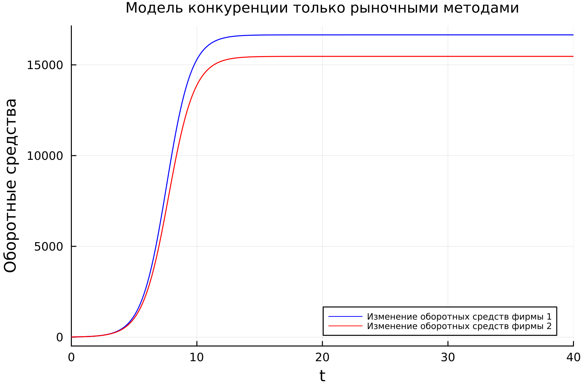
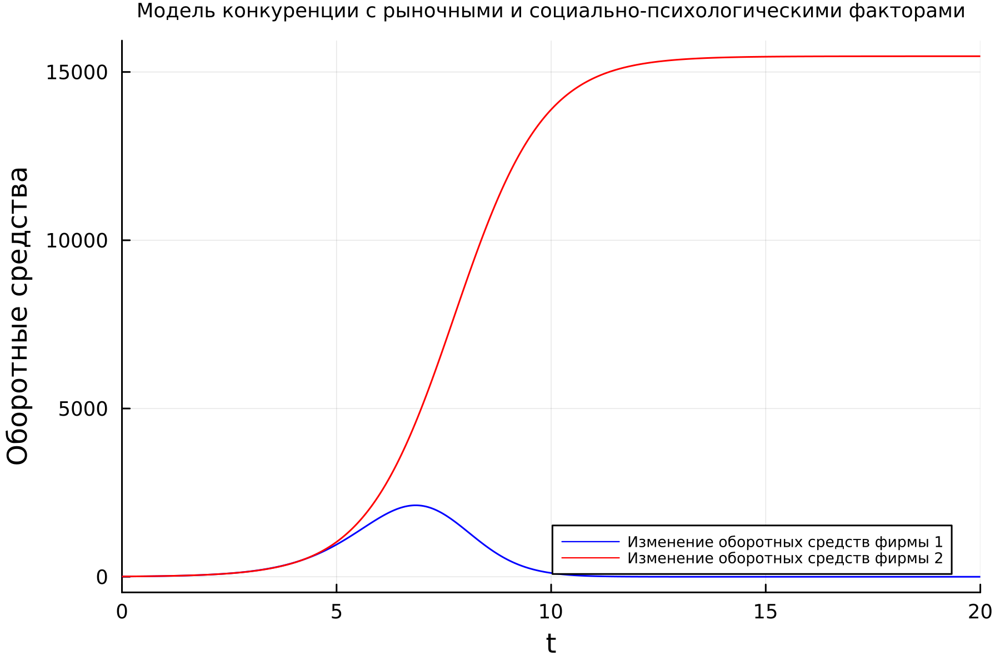
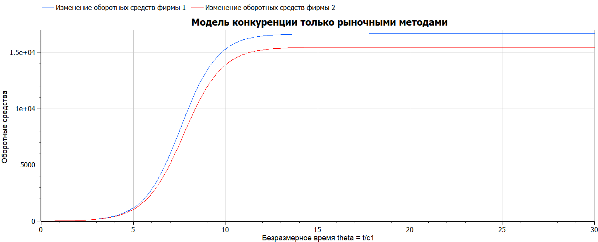
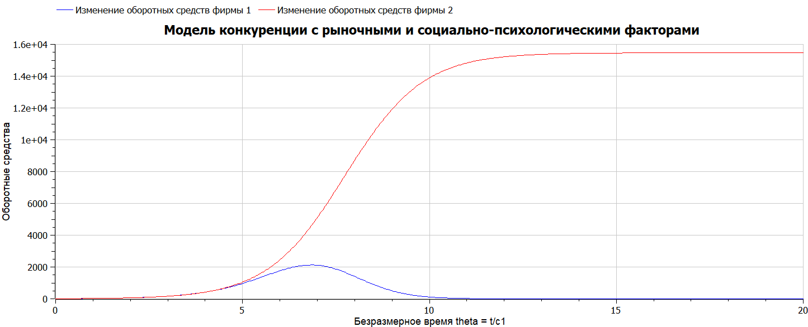

---
## Front matter
title: "Лабораторная работа №8"
subtitle: "Математическое моделирование"
author: "Николаев Дмитрий Иванович"

## Generic otions
lang: ru-RU
toc-title: "Содержание"

## Bibliography
bibliography: bib/cite.bib
csl: pandoc/csl/gost-r-7-0-5-2008-numeric.csl

## Pdf output format
toc: true # Table of contents
toc-depth: 2
lof: true # List of figures
lot: true # List of tables
fontsize: 12pt
linestretch: 1.5
papersize: a4
documentclass: scrreprt
## I18n polyglossia
polyglossia-lang:
  name: russian
  options:
	- spelling=modern
	- babelshorthands=true
polyglossia-otherlangs:
  name: english
## I18n babel
babel-lang: russian
babel-otherlangs: english
## Fonts
mainfont: PT Serif
romanfont: PT Serif
sansfont: PT Sans
monofont: PT Mono
mainfontoptions: Ligatures=TeX
romanfontoptions: Ligatures=TeX
sansfontoptions: Ligatures=TeX,Scale=MatchLowercase
monofontoptions: Scale=MatchLowercase,Scale=0.9
## Biblatex
biblatex: true
biblio-style: "gost-numeric"
biblatexoptions:
  - parentracker=true
  - backend=biber
  - hyperref=auto
  - language=auto
  - autolang=other*
  - citestyle=gost-numeric
## Pandoc-crossref LaTeX customization
figureTitle: "Рис."
tableTitle: "Таблица"
listingTitle: "Листинг"
lofTitle: "Список иллюстраций"
lotTitle: "Список таблиц"
lolTitle: "Листинги"
## Misc options
indent: true
header-includes:
  - \usepackage{indentfirst}
  - \usepackage{float} # keep figures where there are in the text
  - \floatplacement{figure}{H} # keep figures where there are in the text
---

# Цель работы

Рассмотреть модель конкуренции двух фирм в двух случаях: конкуренция двух фирм чисто рыночными методами и конкуренция с учетом рыночных и социально-психологических факторов. Построить графики изменения оборотных средств предприятий.

# Задание

Вариант 29

**Случай 1.** Рассмотрим две фирмы, производящие взаимозаменяемые товары одинакового качества и находящиеся в одной рыночной нише. Считаем, что в рамках нашей модели конкурентная борьба ведётся только рыночными методами. То есть, конкуренты могут влиять на противника путем изменения параметров своего производства: себестоимость, время цикла, но не могут прямо вмешиваться в ситуацию на рынке («назначать» цену или влиять на потребителей каким-либо иным способом.) Будем считать, что постоянные издержки пренебрежимо малы, и в модели учитывать не будем. В этом случае динамика изменения объемов продаж фирмы 1 и фирмы 2 описывается следующей системой уравнений:
$$
\begin{aligned}
\frac{dM_1}{d\theta} & = M_1 - \frac{b}{c_1} M_1 M_2 - \frac{a_1}{c_1} M_1^2 \\
\frac{dM_2}{d\theta} & = \frac{c_2}{c_1} M_2 - \frac{b}{c_1} M_1 M_2 - \frac{a_2}{c_1} M_2^2,
\end{aligned}
$$
где
$$
a_1 = \frac{p_{cr}}{\tau_1^2 \tilde {p}_1^2 N q}, \quad a_2 = \frac{p_{cr}}{\tau_2^2 \tilde {p}_2^2 N q}, \quad b = \frac{p_{cr}}{\tau_1^2 \tilde {p}_1^2 \tau_2^2 \tilde {p}_2^2 N q}, \quad c_1 = \frac{p_{cr} - \tilde {p}_1}{\tau_1 \tilde {p}_1}, \quad c_2 = \frac{p_{cr} - \tilde {p}_2}{\tau_2 \tilde {p}_2}.
$$
Также введена нормировка $t = c_1 \theta$.

**Случай 2.** Рассмотрим модель, когда, помимо экономического фактора влияния (изменение себестоимости, производственного цикла, использование кредита и т.п.), используются еще и социально-психологические факторы --- формирование общественного предпочтения одного товара другому, не зависимо от их качества и цены. В этом случае взаимодействие двух фирм будет зависеть друг от друга, соответственно коэффициент перед $M_1 M_2$ будет отличаться. Пусть в рамках рассматриваемой модели динамика изменения объемов продаж фирмы 1 и фирмы 2 описывается следующей системой уравнений:
$$
\begin{aligned}
\frac{dM_1}{d\theta} & = M_1 - \left(\frac{b}{c_1} + 0.00019 \right) M_1 M_2 - \frac{a_1}{c_1} M_1^2 \\
\frac{dM_2}{d\theta} & = \frac{c_2}{c_1} M_2 - \frac{b}{c_1} M_1 M_2 - \frac{a_2}{c_1} M_2^2,
\end{aligned}
$$
Для обоих случаев рассмотрим задачу со следующими начальными условиями и параметрами:
$M_0^1 = 8.5$, $M_0^2 = 9.1$, $p_{cr} = 33$, $N = 83$, $q = 1$, $\tau_1 = 27$, $\tau_2 = 24$, $\tilde {p}_1 = 11.3$, $\tilde {p}_2 = 12.5$.

_Замечание:_ Значения $p_{cr}, \widetilde {p}_{1,2}, N$ указаны в тысячах единиц, а значения $M_{1,2}$ указаны в млн. единиц.

_Обозначения:_

- $N$ --- число потребителей производимого продукта;
- $\tau$ --- длительность производственного цикла;
- $p$ --- рыночная цена товара;
- $\tilde p$ --- себестоимость продукта, то есть переменные издержки на производство единицы продукции;
- $q$ --- максимальная потребность одного человека в продукте в единицу времени;
- $\theta = \frac{t}{c_1}$ --- безразмерное время;
- $M_0$ --- оборотные средства предприятия в начале конкурентной борьбы.

1. Постройте графики изменения оборотных средств фирмы 1 и фирмы 2 без учета постоянных издержек и с веденной нормировкой для случая 1.
2. Постройте графики изменения оборотных средств фирмы 1 и фирмы 2 без учета постоянных издержек и с веденной нормировкой для случая 2.

# Теоретическое введение

**Модель одной фирмы**

Для построения модели конкуренции хотя бы двух фирм необходимо рассмотреть модель одной фирмы. Вначале рассмотрим модель фирмы, производящей продукт долговременного пользования, когда цена его определяется балансом спроса и предложения. Примем, что этот продукт занимает определенную нишу рынка и конкуренты в ней отсутствуют.
Обозначим:

- $N$ --- число потребителей производимого продукта.
- $S$ --- доходы потребителей данного продукта. Считаем, что доходы всех потребителей одинаковы. Это предположение справедливо, если речь идет об одной рыночной нише, т.е. производимый продукт ориентирован на определенный слой населения.
- $M$ --- оборотные средства предприятия.
- $\tau$ --- длительность производственного цикла.
- $p$ --- рыночная цена товара.
- $\tilde p$ --- себестоимость продукта, то есть переменные издержки на производство единицы продукции.
- $\delta$ --- доля оборотных средств, идущая на покрытие переменных издержек.
- $\kappa$ --- постоянные издержки, которые не зависят от количества выпускаемой продукции.
- $Q (\frac{S}{p})$ --- функция спроса, зависящая от отношения дохода $S$ к цене $p$. Она равна количеству продукта, потребляемого одним потребителем в единицу времени.

Функцию спроса товаров долговременного использования часто представляют в простейшей форме:
\begin{equation} \label{1}
Q = q - k \frac{p}{S} = q \left(1 - \frac{p}{p_{cr}}\right),
\end{equation}
где $q$ --- максимальная потребность одного человека в продукте в единицу времени. Эта функция падает с ростом цены и при $p = p_{cr}$ (критическая стоимость продукта) потребители отказываются от приобретения товара. Величина $p_{cr} = S \frac{q}{k}$. Параметр $k$ --- мера эластичности функции спроса по цене. Таким образом, функция спроса в форме \eqref{1} является пороговой (то есть, $Q(\frac{S}{p}) = 0$ при $p \ge p_{cr}$) и обладает свойствами насыщения.

Уравнения динамики оборотных средств можно записать в виде
\begin{equation} \label{2}
\frac{dM}{dt} = -\frac{M \delta}{\tau} + NQp - \kappa = -\frac{M \delta}{\tau} + Nq\left(1 - \frac{p}{p_{cr}}\right)p - \kappa.
\end{equation}
Уравнение для рыночной цены $p$ представим в виде
\begin{equation} \label{3}
\frac{dp}{dt} = \gamma \left(-\frac{M \delta}{\tau \tilde p} + Nq\left(1 - \frac{p}{p_{cr}}\right)\right).
\end{equation}
Первый член соответствует количеству поставляемого на рынок товара (то есть, предложению), а второй член --- спросу.

Параметр $\gamma$ зависит от скорости оборота товаров на рынке. Как правило, время торгового оборота существенно меньше времени производственного цикла $\tau$. При заданном $M$ уравнение \eqref{3} описывает быстрое стремление цены к равновесному значению цены, которое устойчиво.

В этом случае уравнение \eqref{3} можно заменить алгебраическим соотношением
\begin{equation} \label{4}
-\frac{M \delta}{\tau \tilde p} + Nq\left(1 - \frac{p}{p_{cr}}\right) = 0.
\end{equation}
Из \eqref{4} следует, что равновесное значение цены $p$ равно
\begin{equation} \label{5}
p = p_{cr}\left(1 - \frac{M \delta}{\tau \tilde p Nq}\right).
\end{equation}
Уравнение \eqref{2} с учетом \eqref{5} приобретает вид
\begin{equation} \label{6}
\frac{dM}{dt} = M \frac{\delta}{\tau}\left(\frac{p_{cr}}{\tilde p} - 1\right) - M^2\left(\frac{\delta}{\tau \tilde p}\right)^2 \frac{p_{cr}}{Nq} - \kappa.
\end{equation}
Уравнение \eqref{6} имеет два стационарных решения, соответствующих условию $\frac{dM}{dt} = 0$:
\begin{equation} \label{7}
\tilde {M}_{1,2} = \frac{1}{2}a \pm \sqrt{\frac{a^2}{4} - b},
\end{equation}
где
\begin{equation} \label{8}
a = Nq\left(1 - \frac{\tilde p}{p_{cr}}\right) \tilde p \frac{\tau}{\delta}, \quad b = \kappa Nq\frac{(\tau \tilde p)^2}{p_{cr} \delta^2}.
\end{equation}
Из \eqref{7} следует, что при больших постоянных издержках (в случае $a^2 < 4b$) стационарных состояний нет. Это означает, что в этих условиях фирма не может функционировать стабильно, то есть, терпит банкротство. Однако, как правило, постоянные затраты малы по сравнению с переменными (то есть, $b \ll a^2$) и играют роль, только в случае, когда оборотные средства малы. При $b \ll a$ стационарные значения $M$ равны
\begin{equation} \label{9}
\tilde {M}_{+} = Nq\frac{\tau}{\delta}\left(1 - \frac{\tilde p}{p_{cr}}\right) \tilde p, \quad \tilde {M}_{-} = \kappa \tilde {p} \frac{\tau}{\delta (p_{cr} - \tilde p)}.
\end{equation}
Первое состояние $\tilde {M}_{+}$ устойчиво и соответствует стабильному функционированию предприятия. Второе состояние $\tilde {M}_{-}$ неустойчиво, так, что при $M < \tilde {M}_{-}$ оборотные средства падают ($\frac{dM}{dt} < 0$), то есть, фирма идет к банкротству. По смыслу $\tilde {M}_{-}$ соответствует начальному капиталу, необходимому для входа в рынок.

В обсуждаемой модели параметр $\delta$ всюду входит в сочетании с $\tau$. Это значит, что уменьшение доли оборотных средств, вкладываемых в производство, эквивалентно удлинению производственного цикла. Поэтому мы в дальнейшем положим: $\delta = 1$, а параметр $\tau$ будем считать временем цикла, с учётом сказанного [@lab8].

# Выполнение лабораторной работы

## Постановка задачи

**Конкуренция двух фирм**

***Случай 1***

Рассмотрим две фирмы, производящие взаимозаменяемые товары одинакового качества и находящиеся в одной рыночной нише. Последнее означает,
что у потребителей в этой нише нет априорных предпочтений, и они приобретут тот или иной товар, не обращая внимания на знак фирмы.

В этом случае, на рынке устанавливается единая цена, которая определяется балансом суммарного предложения и спроса. Иными словами, в рамках нашей модели конкурентная борьба ведётся только рыночными методами. То есть, конкуренты могут влиять на противника путем изменения параметров своего производства: себестоимость, время цикла, но не могут прямо вмешиваться в ситуацию на рынке («назначать» цену или влиять на потребителей каким-либо иным способом).

Уравнения динамики оборотных средств запишем по аналогии с \eqref{2} в виде
\begin{equation}
\begin{aligned} \label{10}
\frac{dM_1}{dt} & = -\frac{M_1}{\tau_1} + N_1 q\left(1 - \frac{p}{p_{cr}}\right)p - \kappa_1 \\
\frac{dM_2}{dt} & = -\frac{M_2}{\tau_2} + N_2 q\left(1 - \frac{p}{p_{cr}}\right)p - \kappa_2,
\end{aligned}
\end{equation}
где использованы те же обозначения, а индексы 1 и 2 относятся к первой и второй фирме, соответственно. Величины $N_1$ и $N_2$ --- числа потребителей, приобретших товар первой и второй фирмы.

Учтем, что товарный баланс устанавливается быстро, то есть, произведенный каждой фирмой товар не накапливается, а реализуется по цене $p$.
Тогда
\begin{equation}
\begin{aligned} \label{11}
\frac{M_1}{\tau_1 \tilde {p}_1} & = N_1 q\left(1 - \frac{p}{p_{cr}}\right) \\
\frac{M_2}{\tau_2 \tilde {p}_2} & = N_2 q\left(1 - \frac{p}{p_{cr}}\right),
\end{aligned}
\end{equation}
где $\tilde {p}_1$ и $\tilde {p}_2$ --- себестоимости товаров в первой и второй фирме.

С учетом \eqref{10} представим \eqref{11} в виде
\begin{equation}
\begin{aligned} \label{12}
\frac{dM_1}{dt} & = -\frac{M_1}{\tau_1}\left(1 - \frac{p}{\tilde {p}_1}\right) - \kappa_1 \\
\frac{dM_2}{dt} & = -\frac{M_2}{\tau_2}\left(1 - \frac{p}{\tilde {p}_2}\right) - \kappa_2.
\end{aligned}
\end{equation}
Уравнение для цены, по аналогии с \eqref{3},
\begin{equation} \label{13}
\frac{dp}{dt} = -\gamma \left(\frac{M_1}{\tau_1 \tilde {p}_1} + \frac{M_2}{\tau_2 \tilde {p}_2} - Nq\left(1 - \frac{p}{p_{cr}}\right)\right).
\end{equation}
Считая, как и выше, что ценовое равновесие устанавливается быстро, получим:
\begin{equation} \label{14}
p = p_{cr}\left(1 - \frac{1}{Nq}\left(\frac{M_1}{\tau_1 \tilde {p}_1} + \frac{M_2}{\tau_2 \tilde {p}_2}\right)\right).
\end{equation}
Подставив \eqref{14} в \eqref{12} имеем:
\begin{equation}
\begin{aligned} \label{15}
\frac{dM_1}{dt} & = c_1 M_1 - b M_1 M_2 - a_1 M_1^2 - \kappa_1 \\
\frac{dM_2}{dt} & = c_2 M_2 - b M_1 M_2 - a_2 M_2^2 - \kappa_2,
\end{aligned}
\end{equation}
где
\begin{equation} \label{16}
a_1 = \frac{p_{cr}}{\tau_1^2 \tilde {p}_1^2 N q}, \quad a_2 = \frac{p_{cr}}{\tau_2^2 \tilde {p}_2^2 N q}, \quad b = \frac{p_{cr}}{\tau_1^2 \tilde {p}_1^2 \tau_2^2 \tilde {p}_2^2 N q}, \quad c_1 = \frac{p_{cr} - \tilde {p}_1}{\tau_1 \tilde {p}_1}, \quad c_2 = \frac{p_{cr} - \tilde {p}_2}{\tau_2 \tilde {p}_2}.
\end{equation}
Исследуем систему \eqref{15} в случае, когда постоянные издержки ($\kappa_1$, $\kappa_2$) пренебрежимо малы. И введем нормировку $t = c_1 \theta$. Получим следующую систему:
\begin{equation}
\begin{aligned} \label{17}
\frac{dM_1}{d\theta} & = M_1 - \frac{b}{c_1} M_1 M_2 - \frac{a_1}{c_1} M_1^2 \\
\frac{dM_2}{d\theta} & = \frac{c_2}{c_1} M_2 - \frac{b}{c_1} M_1 M_2 - \frac{a_2}{c_1} M_2^2,
\end{aligned}
\end{equation}
Чтобы решить систему \eqref{17} необходимо знать начальные условия.

***Случай 2***

Рассмотрим модель, когда, помимо экономического фактора влияния (изменение себестоимости, производственного цикла, использование кредита и т.п.), используются еще и социально-психологические факторы --- формирование общественного предпочтения одного товара другому, не зависимо от их качества и цены. В этом случае взаимодействие двух фирм будет зависеть друг от друга, соответственно коэффициент перед $M_1 M_2$ будет отличаться.

Рассмотрим следующую модель:
\begin{equation}
\begin{aligned} \label{18}
\frac{dM_1}{d\theta} & = M_1 - \left(\frac{b}{c_1} + \chi \right) M_1 M_2 - \frac{a_1}{c_1} M_1^2 \\
\frac{dM_2}{d\theta} & = \frac{c_2}{c_1} M_2 - \frac{b}{c_1} M_1 M_2 - \frac{a_2}{c_1} M_2^2,
\end{aligned}
\end{equation}
где $\chi$ --- коэффициент, отвечающий за формирование общественного предпочтения одного товара другому. Начальные условия и известные параметры остаются прежними.

***Замечание:*** 
Стоит отметить, что рассматривается упрощенная модель, которая дает модельное решение. В реальности факторов, влияющих на динамику изменения оборотных средств предприятий, больше.

## Реализация на Julia

- Изменение оборотных средств двух фирм в моделе, где конкурентная борьба осуществляется только рыночными методами (Рис. [@fig:001]).
- Изменение оборотных средств двух фирм в моделе, где учитываются не только рыночные факторы, но и социально-психологические --- формирование общественного предпочтения одного товара другому (Рис. [@fig:002]).

Код на Julia:

```julia
using Plots
using DifferentialEquations

const M1_0 = 8.5; # Оборотные средства предприятия 1 в начале (в млн)
const M2_0 = 9.1; # Оборотные средства предприятия 2 в начале (в млн)
const p_cr = 33; # Критическая стоимость продукта 
#(больше нее отказываются покупать) (в тыс)
const N = 83; # Число потребителей производимого продукта (в тыс)
const q = 1; # максимальная потребность одного человека в продукте 
#в единицу времени
const tau1 = 27; # Длительность производственного цикла на 1 предприятии
const tau2 = 24; # Длительность производственного цикла на 2 предприятии
const p1 = 11.3; # Себестоимость продукта на 1 предприятии (в тыс)
const p2 = 12.5; # Себестоимость продукта на 5 предприятии (в тыс)

a1 = p_cr / (tau1^2 * p1^2 * N * q);
a2 = p_cr / (tau2^2 * p2^2 * N * q);
b = p_cr / (tau1^2 * p1^2 * tau2^2 * p2^2 * N * q);
c1 = (p_cr - p1) / (tau1 * p1);
c2 = (p_cr - p2) / (tau2 * p2);


# u[1] - M1(theta), u[2] - M2(theta), 
#где M - Оборотные средства предприятия, 
# theta = t/c1 - безразмерное время (для нормировки) 
#du[1]=dM1/d(theta), du[2]=dM2/d(theta)
"Модель конкуренции только рыночными методами"
function lorenz1!(du,u,p,t)
    du[1] = u[1] - b*u[1]*u[2]/c1 - a1*u[1]*u[1]/c1
    du[2] = c2*u[2]/c1 - b*u[1]*u[2]/c1 - a2*u[2]*u[2]/c1
end
"Модель конкуренции с рыночными и социально-психологическими факторами"
function lorenz2!(du,u,p,t)
    du[1] = u[1] - (b/c1 + 0.00019)*u[1]*u[2] - a1*u[1]*u[1]/c1
    du[2] = c2*u[2]/c1 - b*u[1]*u[2]/c1 - a2*u[2]*u[2]/c1
end

const u0 = [M1_0, M2_0]
const T1 = [0.0, 40.0]
const T2 = [0.0, 20.0]

prob1 = ODEProblem(lorenz1!, u0, T1)
prob2 = ODEProblem(lorenz2!, u0, T2)

sol1 = solve(
    prob1,
    abstol=1e-8,
    reltol=1e-8)
sol2 = solve(
    prob2,
    abstol=1e-8,
    reltol=1e-8)

plt1 = plot(
    dpi=300,
    legend=true)
plot!(
    plt1,
    sol1,
    idxs=(0,1),
    label="Изменение оборотных средств фирмы 1",
    xlabel="Безразмерное время theta = t/c1",
    ylabel="Оборотные средства",
    formatter=:plain,
    legend_position=:bottomright,
    titlefontsize=:10,
    legend_font_pointsize=:6,
    color=:blue,
    title="Модель конкуренции только рыночными методами")
plot!(
    plt1,
    sol1,
    idxs=(0,2),
    label="Изменение оборотных средств фирмы 2",
    color=:red)


plt2 = plot(
    dpi=300,
    legend=true)
plot!(
    plt2,
    sol2,
    idxs=(0,1),
    label="Изменение оборотных средств фирмы 1",
    xlabel="Безразмерное время theta = t/c1",
    ylabel="Оборотные средства",
    formatter=:plain,
    legend_position=:bottomright,
    titlefontsize=:8,
    legend_font_pointsize=:6,
    color=:blue,
    title="Модель конкуренции с рыночными и социально-психологическими факторами")
plot!(
    plt2,
    sol2,
    idxs=(0,2),
    label="Изменение оборотных средств фирмы 2",
    color=:red)

savefig(plt1, "image/lab08_1.png")
savefig(plt2, "image/lab08_2.png")
```

## Реализация на OpenModelica

- Изменение оборотных средств двух фирм в моделе, где конкурентная борьба осуществляется только рыночными методами (Рис. [@fig:003]).
- Изменение оборотных средств двух фирм в моделе, где учитываются не только рыночные факторы, но и социально-психологические --- формирование общественного предпочтения одного товара другому (Рис. [@fig:004]).

Код на OpenModelica:

Первая модель конкуренции с применением только рыночных методов:

```OpenModelica
model Market
constant Real p_cr = 33; // Критическая стоимость продукта 
//(больше нее отказываются покупать) (в тыс)
constant Real N = 83; // Число потребителей производимого продукта (в тыс)
constant Real q = 1; // максимальная потребность одного человека 
//в продукте в единицу времени
constant Real tau1 = 27; // Длительность производственного цикла 
//на 1 предприятии
constant Real tau2 = 24; // Длительность производственного цикла 
//на 2 предприятии
constant Real p1 = 11.3; // Себестоимость продукта на 1 предприятии (в тыс)
constant Real p2 = 12.5; // Себестоимость продукта на 2 предприятии (в тыс)

constant Real a1 = p_cr / (tau1^2 * p1^2 * N * q);
constant Real a2 = p_cr / (tau2^2 * p2^2 * N * q);
constant Real b = p_cr / (tau1^2 * p1^2 * tau2^2 * p2^2 * N * q);
constant Real c1 = (p_cr - p1) / (tau1 * p1);
constant Real c2 = (p_cr - p2) / (tau2 * p2);

Real M1; // Оборотные средства предприятия 1
Real M2; // Оборотные средства предприятия 2
initial equation
M1 = 8.5; // Оборотные средства предприятия 1 в начале (в млн)
M2 = 9.1; // Оборотные средства предприятия 2 в начале (в млн) 
equation
der(M1)= M1 - (b/c1)*M1*M2 - (a1/c1)*M1*M1;
der(M2)=(c2/c1)*M2 - (b/c1)*M1*M2 - (a2/c1)*M2*M2;
end Market;
```

Вторая модель конкуренции с учетом рыночных и социально-психологических факторов:

```OpenModelica
model Market_SocPsy
constant Real p_cr = 33; // Критическая стоимость продукта 
//(больше нее отказываются покупать) (в тыс)
constant Real N = 83; // Число потребителей производимого продукта (в тыс)
constant Real q = 1; // максимальная потребность одного человека 
//в продукте в единицу времени
constant Real tau1 = 27; // Длительность производственного цикла 
//на 1 предприятии
constant Real tau2 = 24; // Длительность производственного цикла 
//на 2 предприятии
constant Real p1 = 11.3; // Себестоимость продукта на 1 предприятии (в тыс)
constant Real p2 = 12.5; // Себестоимость продукта на 2 предприятии (в тыс)

constant Real a1 = p_cr / (tau1^2 * p1^2 * N * q);
constant Real a2 = p_cr / (tau2^2 * p2^2 * N * q);
constant Real b = p_cr / (tau1^2 * p1^2 * tau2^2 * p2^2 * N * q);
constant Real c1 = (p_cr - p1) / (tau1 * p1);
constant Real c2 = (p_cr - p2) / (tau2 * p2);

Real M1; // Оборотные средства предприятия 1
Real M2; // Оборотные средства предприятия 2
initial equation
M1 = 8.5; // Оборотные средства предприятия 1 в начале (в млн)
M2 = 9.1; // Оборотные средства предприятия 2 в начале (в млн) 
equation
der(M1)= M1 - (b/c1 + 0.00019)*M1*M2 - (a1/c1)*M1*M1;
der(M2)=(c2/c1)*M2 - (b/c1)*M1*M2 - (a2/c1)*M2*M2;
end Market_SocPsy;
```

## Полученные графики

{#fig:001 width=90%}

{#fig:002 width=90%}

{#fig:003 width=90%}

{#fig:004 width=90%}

Как можно заметить, в первом случае каждая фирма достигает свое максимальное значение оборотных средств (объем продаж) и остается на рынке с этим постоянным значением, то есть каждая фирма захватывает свою часть рынка потребителей, которая остается неизменной. Во втором же случае первая фирма достигает свой максимальный объем продаж, затем начинает нести убытки и терпит банкротство, тогда как динамика роста объемов оборотных средств второй фирмы остается без изменения: достигнув максимального значения, остается на том же  уровне.

# Выводы

В ходе выполнения лабораторной работы я рассмотрел модель конкуренции двух фирм в двух случаях: исключительно рыночные факторы и рыночные вместе с социально-психологическими факторами. Построил графики изменения оборотных средств для обоих случаев и проанализировал их.

# Список литературы{.unnumbered}

::: {#refs}
:::
